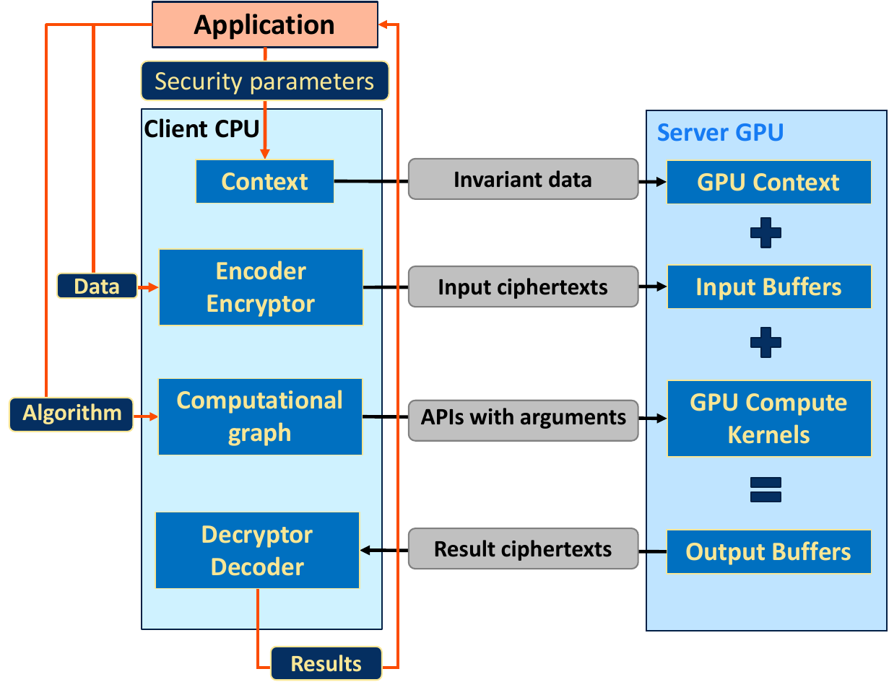
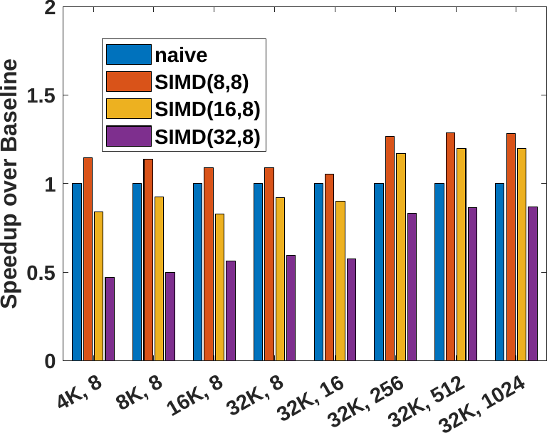

.. header:: XeHE: An Intel GPU Accelerated Fully Homomorphic Encryption Library

.. footer:: Page ###Page###

.. |scriptsize| raw:: latex

   \scriptsize

.. |frontmatter| raw:: html

	Alexander Lyashevsky, Intel Corporation, Santa Clara, CA, USA 
	Alexey Titov, Intel Corporation, Santa Clara, CA, USA 
	Yiqin Qiu, Intel Corporation, Santa Clara, CA, USA 
	Yujia Zhai, University of California, Riverside, CA, USA 
	Edited by James Reinders with assistance from Henry Gabb and John Pennycook 
	ISBN-13 (pbk): 979-8-88638-000-2 
	ISBN-13 (electronic): 979-8-88638-001-9 
	Copyright © 2023 by Codeplay Software, an independently managed wholly owned subsidiary of Intel Corporation 
	This book is licensed under the Creative Commons Attribution 4.0 International License. To view a copy of this license, visit <a href="https://creativecommons.org/licenses/by/4.0/">https://creativecommons.org/licenses/by/4.0/</a> or send a letter to Creative Commons, PO Box 1866, Mountain View, CA 94042, USA. The images or other third party material in this book are included in the book's Creative Commons license, unless indicated otherwise in a credit line to the material. If material is not included in the book's Creative Commons license and your intended use is not permitted by statutory regulation or exceeds the permitted use, you will need to obtain permission directly from the copyright holder. 
	Trademarked names, logos, and images may appear in this book. Rather than use a trademark symbol with every occurrence of a trademarked name, logo, or image we use the names, logos, and images only in an editorial fashion and to the benefit ofthe trademark owner, with no intention of infringement of the trademark. 
	The use in this publication of trade names, trademarks, service marks, and similar terms, even if they are not identified as such, is not to be taken as an expression of opinion as to whether or not they are subject to proprietary rights. 
	SYCL and the SYCL logo are trademarks of the Khronos Group Inc. in the U.S. and/or other countries. Intel, the Intel logo, Intel Optane, and Xeon are trademarks of Intel Corporation in the U.S. and/or other countries. Khronos and the Khronos Group logo are trademarks of the Khronos Group Inc. in the U.S. and/or other countries. OpenCL and the OpenCL logo are trademarks of Apple Inc. in the U.S. and/or other countries. OpenMP and the OpenMP logo are trademarks of the OpenMP Architecture Review Board in the U.S. and/or other countries.
	While the advice and information in this book are believed to be true and accurate atthe date of publication, neither the authors nor the editors nor the publisher can accept any legal responsibility for any errors or omissions that may be made.  The authors, editors, copyright holder, and publisher make no warranty, express or implied, with respect to the material contained herein. 
	Any source code or other supplementary material referenced is available to readers online. To find exactly where, visit the sparklers directory at <a href="https://github.com/syclsparklers/directory/blob/main/README.md">https://github.com/syclsparklers/directory/blob/main/README.md</a> (or use the tinyurl link: <a href="https://tinyurl.com/syclsparklers">https://tinyurl.com/syclsparklers</a>). 

-------------------------------------------------------------------
XeHE: An Intel GPU Accelerated Fully Homomorphic Encryption Library
-------------------------------------------------------------------

|frontmatter|

.. index:: ! acknowledgements

Acknowledgements
================

We would like to acknowledge and thank our friends and colleagues for their inputs, advice, discussions, and help in this project:
Fabian Boemer, Rosario Cammarota, Volley  Chen, Srinivas Chennupaty, Fangwen  Fu, Allison Gehrke, Hong Jiang, Mohannad Ibrahim, and Lian Tang.

Preface
=======

.. index:: ! SYCL Sparklers

Welcome to this installment in a series of detailed pieces that share insights gained in real world
projects using C++ with SYCL. This series is known as *SYCL Sparklers* thanks to their
ability to enlighten us in programming C++ with SYCL.

In a *SYCL Sparkler*, developers share details of their implementations as well as key insights
(lessons learned).  They discuss not only what worked, but what did not work---at least what did
not work initially. Learning effective use of any programing technique is boosted by learning the
best thought processes to achieve programming results, and this is boosted by learning from the
successes *and* false starts that other experts experience on the road to success. We appreciate the
honesty of the authors in exposing their learnings, and happily include such discussions here that
would not be explored in depth in most publications.

.. index:: ! Intel GPU

In this piece, the authors share learnings from a project to create and optimize a SYCL-based GPU
backend for Microsoft SEAL.  Multiple optimizations are discussed including organizing to benefit
from local memory, instruction optimization for modular addition and multiplication operations,
and reduce memory allocation costs.  Their insights are
invaluable lessons discussed in this fascinating implementation.

.. index:: ! duality

The authors also explore how having two GPU architectures (tiled and not tiled) help them tune their
code to be more portable, and that supporting another duality (Linux and Windows) proved invaluable
in expanding the test coverage substantially making our code robust sooner.

.. index:: ! Hardware configurations not shared, ! Purpose of performance data

None of the performance numbers shown in this piece are intended to provide guidance on hardware
selection.  The authors offer their results and observations only to illustrate the magnitude of
changes that may correspond to the optimizations being discussed.  It is hoped that readers will
find the information valuable to motivate their own optimization work on their applications using
some of the techniques highlighted here.

In future installments of this series, we offer many different ways to gain insights into
the effective use of C++ with SYCL.
This installment offers only one of many examples of the diverse ways C++ with SYCL can be used.

.. index:: ! Homomorphic Encryption (HE), Privacy-Preserving Computing,
           ! SYCL, ! Microsoft SEAL, CKKS, Number Theoretic Transform
	
.. index:: ! implementation

Sharing: Our Implementation
===========================

Homomorphic Encryption (HE) is an emerging encryption scheme that allows computations to be
performed directly on encrypted messages. This property provides promising applications such as
privacy-preserving deep learning and cloud computing. Prior works have been proposed to enable
practical privacy-preserving applications with architectural-aware optimizations on CPUs,
CUDA-enabled GPUs, and FPGAs. However, there was no systematic optimization for the whole HE pipeline
on Intel GPUs. We present the first-ever SYCL-based GPU backend for Microsoft SEAL
APIs. We perform optimizations from instruction level, algorithmic level, and application level to
accelerate our HE library based on the Cheon, Kim, Kim, and Song (CKKS) scheme on Intel GPUs. The
performance is validated on two experimental (non-production) Intel GPUs. Experimental results, detailed in later sections, show that our staged
optimizations together with optimizations including low-level optimizations and kernel fusion
accelerate the Number Theoretic Transform (NTT), a key algorithm for HE, by up to 9.93X compared
with the naïve GPU baseline. The roofline analysis confirms that our optimized NTT reaches 79.8\%
and 85.7\% of the peak performance on two GPU devices. Through the highly optimized NTT and the
assembly-level optimization, we obtain 2.32X -- 3.05X acceleration for HE evaluation routines. In
addition, our collection of systematic optimizations improve the performance of encrypted
elementwise polynomial matrix multiplication application by up to 3.11X.

All the work shared here is based upon research undertaken by the authors while working at
Intel. This work demonstrates a way to implement a reasonably efficient implementation for
Homomorphic Encryption using modern C++ with SYCL.  As a result of the research, the authors learned
some valuable optimization techniques and insights that the they have taken time to share in this
very interesting and detailed piece.  The testing was done on some experimental GPU devices that
have never been released as products. Nevertheless, the code and lessons learned have great value
for any GPU because so many optimizations and insights are generally applicable. Of course, some
platform dependent optimizations, specifically use of low-level optimizations specific to Intel
GPUs, are less general.  A key value of using C++ with SYCL, is the ability to be portable while
supporting the ability to optimize at a lower level when it is deemed worth the effort. This work
helps illustrate how the authors isolated that optimization work, and their thought process on how
to pick what to optimize.

The code for this implementation is available open source online.
To find exactly where, visit the sparklers directory at
https://github.com/syclsparklers/directory/blob/main/README.md (or use the tinyurl link:
https://tinyurl.com/syclsparklers).

None of the performance numbers shown are intended to provide guidance on hardware selection. The
authors offer their results and observations only to illustrate the magnitude of changes that may
correspond to the optimizations being discussed.  It is hoped that readers will find the information
valuable to motivate their own optimization work on their applications using some of the techniques
highlighted here.

.. index:: !insights

Sharing: Key Insights
=====================
We will dive into each of these areas more, but we will start with a summary here of seven key insights.

.. index:: !vISA

Hand-Tuned vISA
---------------

Initially we thought that the compiler would generate reasonably well optimized instruction
sequences for our *mod* operations, which turned out not to be the case. Hand-tuning these operations
with Virtual ISA (vISA) at the assembly level provided significant improvement in performance
(although the compiler has largely caught up over time). One drawback of this is that it is
unportable and tied to a specific architecture.

.. index:: !memory allocation overheads

Memory Allocation Overheads
---------------------------

Our initial assumption was that memory allocations were inexpensive and negligible with respect to
overall time. We had to correct ourselves and eliminate a significant overhead for memory
allocations via a memory caching system.

.. index:: !multi-tile scaling

Multi-Tile Scaling
------------------

We initially assumed SYCL would automatically scaling across whole devices efficiently. It turned out that we
needed to explicitly enqueue work-items and memory allocations to sub-devices to saturate the GPU.

.. index:: !event-based profiling

Event-Based Profiling
---------------------

To understand the performance and asynchronous issues, we had to resort to extensively instrumenting
the code with events. Due to the complex and asynchronous nature of the software, we found that
events provided more insights than the VTune profiler.

.. index:: !algorithmic tuning

Algorithmic Tuning
------------------

We initially assumed that leveraging the subgroup shuffles and shared-local memory could provide a
satisfying efficiency for the Number Theoretic Transform (NTT) algorithm. In fact, though we
observed a non-trivial acceleration (40%) from the baseline NTT after applying these two
optimizations, the overall efficiency remained poor (<20%) if compared with theoretical peak
performance. We realized that we should switch to the higher radix NTT implementation, which still
exchanges data through the shared-local memory, but further reuses data at the register level more
aggressively without introducing overheads from intra-work-item shuffles.

.. index:: device throughput

Measuring Device Throughput
---------------------------

One of the key observations for execution efficiency is to check whether enough work is provided for
the device, to ensure the amount of work scheduled aligns well with the device throughput. We
focused on the whole program efficiency with respect to the device throughput, rather than absolute
numbers.

.. index:: ! duality, Windows, Linux, single tile, multi-tile, portability, performance portability
	   
Portability and Performance Portability are Greatly Enhanced by Duality in Development
--------------------------------------------------------------------------------------

Our development approach included a 'duality' in term of both architecture (single tile and
multi-tile) and operating environments (Linux and Windows). Having these dualities during
development allowed adjustments during the original implementation work that would have been much
more difficult had they been left to a later porting phase. The key advantage was that the dualities
exposed issues in correctness, portability, and performance portability early. This led us to create
code that was more portable because we were not designing it too tightly to any one vendor,
architecture, or platform.  While we employed some optimizations that are highly specific to Intel
GPUs, this approach helped push us to do this optimization in a manner that isolates the
optimizations in a managable and useful way.

Introduction
============

.. index:: !cloud computing, !data security

Cloud computing demand continues to grown rapidly but not without growing concern for data security.
Although outsourcing data processing to cloud resources enables
enterprises to relieve the overhead of deployment and maintenance for their private servers, it
raises security and privacy concerns of the potential sensitive data exposure.

Adopting traditional encryption schemes to address this privacy concern is less favorable because a
traditional encryption scheme requires decrypting the data before the computation, which presents a
vulnerability and may diminish or eliminate data privacy. In contrast, HE, an
emerging cryptographic encryption and computation scheme, is considered to be one of the most
promising solutions to such issues. HE allows computations to be performed directly on encrypted
messages without the need for decryption. This encryption scheme, thus, protects private data from
both internal malicious actors and external intruders, while assuming honest computations.

In 1978, Rivest, Adleman, and Dertouzous (Rivest et al. 1978), first introduced the idea of
computing on encrypted data through the use of “privacy homomorphisms". Since then, several distinct
HE schemes have been invented, which can be categorized by the types of encrypted computation they
support. *Partial* HE schemes enable only encrypted additions or multiplications. The famous RSA
cryptosystem is, in fact, the first HE scheme, supporting encrypted modular multiplications. In
contrast, the Paillier cryptosystem (Paillier 1999) is a partial HE scheme that supports only
modular additions.

.. index:: ! CKKS

*Levelled* HE schemes, on the other hand, support both encrypted additions and multiplications, but
only up to a certain circuit depth determined by the encryption parameters. The
Brakerski/Fan-Vercauteren (BFV) (Fan and Vercauteren 2012) and Brakerski-Gentry-Vaikuntanathan (BGV)
(Brakerski, Gentry, and Vaikuntanathan 2014) schemes are two popular leveled HE schemes used today,
which support exact integer computation. In (Cheon et al. 2017), Cheon, Kim, Kim and Song presented
the CKKS scheme, which treats the encryption noise as part of approximation errors that occur during
computations within floating-point numerical representation. This imprecision requires a refined
security model (Li and Micciancio 2021) but provides faster runtimes than BFV/BGV in practice.

*Fully* HE schemes enable an unlimited number of encrypted operations, typically by adding an
expensive bootstrapping step to a levelled HE scheme, as first detailed by Craig Gentry (Gentry
2009). TFHE (Chillotti et al. 2016) improves the runtime of bootstrapping, but requires evaluating
circuits on binary gates, which becomes expensive for standard 32-bit or 64-bit arithmetic. The
improved capabilities and performance of these HE schemes have enabled a host of increasingly
sophisticated real-world privacy-preserving applications. Early applications included basic
statistics and logistic regression evaluation (Naehrig, Lauter, and Vaikuntanathan 2011). More
recently, HE applications have expanded to a wide variety of applications, including privatized
medical data analytics and privacy-preserving machine learning (Bos, Lauter, and Naehrig 2014;
Cheon, Kim, and Lauter, 2015 and r20230402; Boemer et al. 2019; Rathee et al. 2020; Graepel, Lauter, and Naehrig
2012).

To address the memory and runtime overhead of HE — a major obstacle to immediate real-world
deployments, HE libraries support efficient implementations of multiple HE schemes, including
Microsoft SEAL (Laine
2017) (BFV/CKKS), HElib (Halevi and Shoup 2013) (BFV/BGV/CKKS), and PALISADE (Polyakov, Rohloff, and
Ryan 2017) (BGV/BFV/CKKS/TFHE). In (Boemer et al. 2021), Intel published HEXL, accelerating HE
integer arithmetic on finite fields by featuring Intel Advanced Vector Extensions 512 (Intel AVX-512)
instructions. Since GPUs deliver higher memory bandwidth and computing throughput with lower
normalized power consumption, researchers presented libraries such as cuHE (Dai and Sunar 2015),
TFHE (Chillotti et al. 2016) and NuFHE (nucypher, r20230402) to accelerate HE using CUDA-enabled GPUs.

.. index:: ! Intel GPU, ! Number Theoretic Transform

Although HE optimizations on CPUs and CUDA-enabled GPUs have been reported before, an
architecture-aware HE library optimized for Intel GPUs has not been available. In addition, previous
works that accelerate HE libraries mainly focus on optimizing Number Theoretic Transform (NTT) and
inverse NTT (iNTT) computing kernels, since these two algorithms account for the majority of the execution
time of our HE routines (e.g., 72%-81% in its baseline variant on Intel GPUs according to our benchmarks
in :numref:`fig:profilingA` and :numref:`fig:profilingB`).  However, engineering an efficient HE library
requires systematic optimizations for the whole HE pipeline beyond computing kernels.
We present a HE library optimized for Intel GPUs based on the CKKS scheme. We not only
provide a set of highly optimized computing kernels such as NTT and iNTT, but also optimize the
whole HE evaluation pipeline at both the instruction level and application level. More specifically,
these are the topics that we cover:

-  We design and develop the first-ever SYCL-based GPU backend for
   Microsoft SEAL APIs, which is also the first HE library based on the
   CKKS scheme optimized for Intel GPUs.

-  We develop and discuss a staged implementation of NTT leveraging
   shared local memory of Intel GPUs. We also describe NTT optimization
   by employing strategies including high-radix algorithm, kernel
   fusion, and explicit multiple-tile submission.

-  From the instruction level perspective, we describe how to enable
   low-level optimizations for 64-bit integer modular addition and
   modular multiplication using inline assembly. We also provide a fused
   modular multiplication-addition operation to reduce the number of
   costly modular operations.

-  From the application level, we introduce the memory cache mechanism
   to recycle freed memory buffers on device to avoid the run-time
   memory allocation overhead. We also design fully asynchronous HE
   operators and asynchronous end-to-end HE evaluation pipelines.

-  We benchmark our HE library on two latest Intel GPUs. Experimental
   results show that our NTT implementations reaches up to 79.8% and
   85.7% of the theoretical peak performance on both experimental GPUs,
   faster than the naïve GPU baseline by 9.93X and 7.02X, respectively.

-  The proposed and thoroughly discussed NTT and assembly-level
   optimizations accelerate five HE evaluation routines under the CKKS
   scheme by 2.32X -- 3.05X. In addition, the polynomial elementwise
   matrix multiplication applications are accelerated by 2.68X -- 3.11X
   by our entire collection of systematic optimizations.

.. index:: !insights

.. _sec:learning:

Learning Points
===============

We summarized our insights earlier, and here we will dig into them a little more deeply by offering
more technical details behind our prior comments.  Since we will revisit each of these as we discuss
the coding in more detail, you may wish to bookmark this section to read after diving into the
details of the code.  These insights came during our design and development process. After sharing
these insights, we provide high-level comments on the overall software structure in
:ref:`sec:overall-structure`.  Background and related works are introduced in
:ref:`sec:background`. We further detail the system-level designs and optimizations in
:ref:`sec:architecture`. We present the optimization approaches in :ref:`sec:optimizations` as well
as other development strategies in :ref:`sec:development-strategies`. Evaluation results are
provided in :ref:`sec:results`. We conclude by presenting potential future work in
:ref:`sec:conclusion`.

During the development process of the whole software system, we have
been faced with challenges and have learned a series of things. Although
some of which might seem straightforward to a well-experienced
developer, we believe it is of worth to explicitly highlight them before
extending to the design details, in order to better address the
educational nature of our discussion and to provide additional structure
in our explanation.

.. index:: vISA

-  Initially we thought that the compiler would generate reasonably well
   optimized instruction sequences for our **mod** operations. It turns
   out that those elementary operations were not optimally compiled and
   we looked into optimizing them. Virtual ISA (vISA) was a way to
   hand-tune these key operations at the assembly level and provide
   significant improvement in performance. It is worth noting that at
   the end of development the gap between vISA code and
   compiler-generated code has reduced significantly as the compiler has
   caught up with the hand-written assembly sequence, see
   :ref:`sec:visa`. The drawback of this approach is in
   tying to a specific architecture. New GPUs will require this portion of
   code to be revised in order to be functional.

-  Our initial assumption was that memory allocations were inexpensive
   and negligible with respect to overall time. We had to correct
   ourselves and eliminate the significant overhead for memory allocations
   through use of our mem cache system, see :ref:`sec:memcache`.

-  We initially assumed that using C++ with SYCL easily led to scaling across whole device
   efficiently. In fact, it turned out that we needed to explicitly
   subdivide the device and queue work-items and memory allocations
   separately for each sub-device in order to efficiently saturate the
   GPU.

.. index:: event-based profiling
   
-  To understand the performance and asynchronous issues, we had to
   resort to extensively instrumenting the code with events. These
   allow us to meticulously organize the asynchronous workflow and attribute
   time lags correctly. Due to the complexity of our software, we found
   limited help in using the VTune profiler. We found focusing on events was
   most effective for us at that time. It is likely the VTune profiling will
   grow in capabilities but it is always wise to be able to compare
   using it with simply focusing on events as we did.

.. index:: Number Theoretic Transform, !subgroup shuffling

-  We initially assumed that leveraging the subgroup shuffling feature
   as well as the shared-local memory can provide us with a satisfying
   efficiency for the Number Theoretic Transform (NTT) algorithm. In
   fact, though we observed a non-trivial acceleration
   (:math:`\sim`\ 40%) from the baseline NTT after applying these two
   optimizations, the overall efficiency remains poor (<20%) if compared
   with the theoretical peak performance. We realized that we should
   switch to the higher radix NTT implementation, which still exchanges
   data through the shared-local memory, but further reuses data at the
   register level more aggressively without introducing the subgroup
   shuffling overhead for intra-work-item data exchanging.

.. index:: SYCL, !vISA

-  Including vISA limits portability, when used, of any code. It
   ties the execution to a specific platform, even an architecture. This
   can be a drawback introducing additional complexity, when trying to
   have multiple platforms supported. Balancing the pros and cons are important.

.. index:: !device throughput

-  One of the key observations for execution efficiency is to check
   whether enough work is provided for the device. Make sure the amount
   of work scheduled aligns well with the device throughput. Therefore,
   we focused on the whole program efficiency with respect to the device
   throughput, rather than absolute numbers.

Two Lessons in the Value of Duality
===================================

.. index:: duality, Windows, Linux, single tile, multi-tile, portability, ! performance portability

One strong learning, we want to stress is the high value of developing code with multiple targets at
the time of development, instead of developing for one platform (device and OS) and then
porting. Finding non-portable issues during original development proved to have enormous value. We
believe that in this age of ever increasing options in hardware variety from multiple vendors, this
should be the preferred approach in developing portable software. Doing otherwise, leaves too many
design adjustments (large and small) to a porting phase when such adjustments are more difficult and
generally perceived as unplanned work. Both issues make it hard to find time to do the work needed
for portability, and the result is less portable code often suffering extreme degrees of vendor and
architecture lock-in.

For us, having two different GPU architectures representing variety of possible hardware
configurations–--number of EUs, sub-devices. cache sizes, off-chip memory capacity, bandwidth,
etc.---allowed us to study the behavior of the end-to-end application based on real data instead of
relying on “theoretical estimations”. It gave clear indications of the performance gain (or loss)
while moving from one configuration to another simplifying a path the library’s deployment on the
commercially available devices in the near future.

Combined with multiple HE CKKS scheme setups, the variety of architectural configurations challenged
our implementation on multiple levels: usability, functionality, optimization, and scalability to
name a few.

Profiling on both types of GPUs provides insight into how optimization strategies, scaling, memory
buffer tracking algorithm, etc. perform under varying hardware and algorithmic constraints.

For example, depending on the numbers of EUs different strategy can be employed at the core
algorithmic level in assigning different NTT workloads to each work-group, improving utilization the
particular device.

.. index:: scalability

The multi-sub-device configuration gave significant insight into a scalability issues easily
applicable to multi-GPU and multi-node configurations in the future.

Due to different throughput, and latency characteristics on two devices it also helped to fix
multiple asynchronicity issues on functional and performance levels.

We have purposely exploited another duality--Linux and Windows operating systems---by keep the
application running on both it made us feel like it doubled our test coverage. Our experiences in
software development have shown, time and time again, that co-verification on multiple OSs helps to find many issues much
earlier in development cycle.

.. index:: !lock-in

We strongly encourage developing for multiple platforms (devices and operating environments) from
the outset, to be more portable and robust, than if development work is completed on one platform
and then significant new problems only arise when porting. During development, issues can encourage
different structure and approaches by being exposed well before coding is done. This applies to all
prototyping, as well as first implementations. Waiting to port until after development is complete,
will result in less portability and more lock-in to the original development platform.

.. index:: !program structure

.. _sec:overall-structure:

Preliminary Words on the Overall Program Structure
==================================================

You will be able to read about the .gpu() feature of our library later in our explanations.
In a nutshell it marks the HE data (Cyphertext, Plaintext)
as GPU-targeted. The philosophy behind the interface is similar to that
of PyTorch. GPU-"touched" data is going to be processed on GPU without
any additional efforts from a developer. The major goal is to remove any
psychological barrier for a developer to use an accelerated version and
to make an acceleration as painless as possible. If there is a GPU
available it accelerates your software silently and automatically.
As an additional benefit of our .gpu() interface, it enables an easy mix and
much of CPU and GPU processing while debugging. Considering the data in
an encrypted pipeline does not have any interpretable meaning, the
importance of a flexible CPU, GPU compute flow interleaving is apparent.
The most efficient way to debug such a pipeline is to have a "verified"
prototype (e.g., on a CPU) and to compare results bit by bit at every stage
on-line.

The .gpu() interface is not directly connected to the acceleration. The back-end GPU library does
not know why it processes a specific set of Cyphertexts. Our .gpu() approach adds some complexity to
the plugin part of XeHE we are going to discuss later as well (see :ref:`sec:dotgpu`). But we still
think these efforts are worthy since they open a window to a wide range of problems related to
portability and programmability of the accelerated software.

One of the huge advantages of SYCL is that it can play well with C++ in
terms of function signatures, templates, lambda expressions, overloading
rules and other modern C++ features. Other proprietary solutions often
require some special decorations and signatures for kernels and kernel
subroutines. SYCL, however, can reuse C++ routines without
modifications. We have utilized this property for a variety of purposes
during the development and verification cycles. A few well evaluated on
CPUs, but rather complicated algorithms of modulo arithmetic have been
directly inserted as a core parts of GPU kernels without any
modifications. As a result, they produce correct results on GPUs
instantly. It boosts the GPU development productivity enormously.

Yet another helpful trick, induced by this strong alignment to C++, is to develop
a simulation of rather non-obvious GPU kernel on CPU. Later debug it on
CPU and then move to GPU with a single minor modification in function
signature only. In this way, we developed two launching procedures for
the same kernel. One of which has a SYCL queue as its first parameter
while the other without it, with all other arguments kept intact and in
the same exact order.

The procedure, without queue parameters, runs the kernel on the CPU. It does so
in a loop over the kernel working domain, sending the index of the loop
as an additional parameter that simulates the kernel thread index. After
receiving the functionality of the CPU version correctly, the only
things left are to switch to the other launch routine with queue and run
the same (already verified) kernel on the GPU. Admittedly the technology
here is simplified a bit for brevity, but not too much. This trick
allows amazingly fast functional bring-ups for very complex kernels. We discuss
this incredibly positive experience in later sections.

The paragraph devoted to the program structure would not be complete if we
miss mentioning our rather sophisticated project build system. Besides
allowing multiple configurations of the development environment it has
the desirable feature of building an exclusively CPU-based system or by default
GPU-based system (as opposed to the .gpu()-controlled one, see above). This
allows us to evaluate and to compare the behavior and functional correctness
of the system in multiple corner cases.

.. _sec:background:

Background and Related Works
============================

.. index:: Intel GPU

In this section, we briefly introduce the basics of the CKKS HE scheme.  We then introduce the
general architecture of Intel GPUs and summarize prior works of NTT optimizations on both CPUs and GPUs.

.. _sec:ckks:

Basics of CKKS
--------------

.. index:: ! CKKS, Microsoft SEAL

The CKKS scheme was first introduced in (Cheon et al. 2017), enabling approximate computation on
complex numbers. This approximate computation is particularly suitable for real-world floating-point
operations that are approximate by design. Further work improved CKKS to support a full <residue
number system (RNS) (Cheon et al. 2018a) and bootstrapping (Cheon et al. 2018b). In our work, we
select CKKS as our FHE scheme, as implemented in Microsoft SEAL (Laine 2017).

The CKKS scheme is composed of following basic primitives: *KeyGen*, *Encode*, *Decode*, *Encrypt*,
*Decrypt*, *Add*, *Multiply* (*Mul*), *Relinearize* (*Relin*) and *Rescale* (*RS*). To be more
specific, *KeyGen* first generates a set of keys for the CKKS scheme. An input message is encoded to
a plaintext and then encrypted to a ciphertext.  One can evaluate (compute) directly on the
encrypted messages (ciphertexts). Noises are accumulated during the HE evaluation until one applies
a *Relin* followed by a *RS* to the ciphertext. Once all the HE computations are completed, the
result ciphertext is decrypted and decoded, providing the same result as ordinary non-HE
computations. We provide only cursory descriptions here and refer interested readers to (Cheon et
al. 2017) for details.

Number Theoretic Transform and Residue Number System
----------------------------------------------------

.. index:: ! Number Theoretic Transform

As noted in (Longa and Naehrig 2016), the NTT can be exploited to
accelerate multiplications in the polynomial ring
:math:`\mathcal{R}_q=\mathbb{Z}_q[x]/(x^N+1)`. We represent polynomials
using a coefficient embedding:
:math:`\mathbf{a}=(a_0,...,a_{N-1})\in \mathbb{Z}_q^N` and
:math:`\mathbf{b}=(b_0,...,b_{N-1})\in \mathbb{Z}_q^N`. Let
:math:`\omega` be a primitive :math:`N`-th root of unity in
:math:`\mathbb{Z}_q` such that :math:`\omega^N\equiv 1(\mod q)`. In
addition, let :math:`\psi` be the 2\ :math:`N`-th root of unity in
:math:`\mathbb{Z}_q` such that :math:`\psi^2=\omega`. Further defining
:math:`\Tilde{\mathbf{a}}=(a_0,\psi a_1,...,\psi^{N-1}a_{N-1})` and
:math:`\Tilde{\mathbf{b}}=(b_0,\psi b_1,...,\psi^{N-1}b_{N-1})`, one can
quickly verify that for
:math:`\mathbf{c}=\mathbf{a}\cdot \mathbf{b}\in \mathbb{Z}_q^N`, there
holds the relationship :math:`\mathbf{c}=\mathbf{\Psi^{-1}}\odot`
iNTT\ :math:`(`\ NTT\ :math:`(\Tilde{\mathbf{a}})\odot`\ NTT
:math:`(\Tilde{\mathbf{b}}))`. Here :math:`\odot` denotes elementwise
multiplication and :math:`\mathbf{\Psi^{-1}}` represents the vector
:math:`(1,\psi^{-1},\psi^{-2},...,\psi^{-(N-1)})`. Therefore, the total
computational complexity of ciphertext multiplication in
:math:`\mathcal{R}_q` is reduced from :math:`O(N^2)` to
:math:`O(N\log N)`.

.. index:: ! Chinese Remainder Theorem

In practice, since polynomial coefficients in the ring space are big integers under modulus
:math:`q`, multiplying these coefficients becomes computationally expensive. The Chinese Remainder
Theorem (CRT) is typically employed to reduce this cost by transforming large integers to the
Residue Number System (RNS) representation. According to CRT, one can represent the large integer
:math:`x \mod q` using its remainders :math:`(x \mod p_1, x \mod p_2, \hdots, x \mod p_n)`, where
the moduli :math:`(p_1,p_2,...,p_n)` are co-prime such that :math:`\Pi p_i=q`. We note the CKKS
scheme has been improved from the initial presentation in :ref:`sec:ckks` to take full
advantage of the RNS (Cheon et al. 2018a).

To summarize what we have discussed, to multiply polynomials :math:`\mathbf{a}` and
:math:`\mathbf{b}` represented as vectors in :math:`\mathbb{Z}_q^N`, one needs to first perform the
NTT to transform the negative wrapped :math:`\Tilde{\mathbf{a}}` and :math:`\Tilde{\mathbf{b}}` to
the NTT domain. After finishing elementwise polynomial multiplication in the NTT domain, the iNTT
is applied to convert the product to the coefficient embedding domain. When the polynomials are in
RNS form, both the NTT and iNTT are decomposed to :math:`n` concurrent subtasks. Finally, we compute
the outer product result by merging the iNTT-converted polynomial with :math:`\mathbf{\Psi^{-1}}`.

.. _sec:ntt:

NTT optimizations
-----------------

Due to the pervasive usage of NTT and iNTT in HE, prior researchers proposed optimized
implementations for NTT on CPUs(Boemer et al. 2021), CUDA-enabled GPUs(Al Badawi et al. 2018; Goey
et al. 2021; vernamlab, r20230402; Sangpyo Kim et al. 2020) and FPGAs(Sunwoong Kim et al. 2020; Riazi et
al. 2020). On the CPU end, SIMD instructions enable a wider data processing width to accelerate a
broad range of applications (Wang et al. 2013; Zee and Geijn 2015; Intel Math Kernel
Library. Reference Manual 2009; Zhai et al. 2021; Zhao et al. 2020). Leveraging this architectural
feature, Intel HEXL provides a CPU implementation of the radix-2 negacyclic NTT using Intel AVX512
instructions(Boemer et al. 2021) and Harvey’s lazy modular reduction approach (Harvey 2014).
GPU-accelerated NTT implementations typically adopt the hierarchical algorithm first presented by
Microsoft Research for the Discrete Fourier Transform (DFT)(Govindaraju et al. 2008). In (vernamlab,
r20230402), researchers implemented the hierarchical NTT with twiddle factors, which are multiplicative
constants in the butterfly computation stage (i.e.,  :math:`W` the Algorithm shown in :numref:`fig:butterfly-ntt`), cached in shared memory. Rather than caching twiddle factors, in (Sangpyo
Kim et al. 2020), Kim et al. computed some twiddle factors on-the-fly to reduce the cost of modular
multiplication and the memory access number of NTT. In (Goey et al. 2021), Goey et al. considered
the built-in warp shuffling mechanism of CUDA-enabled GPUs to optimize NTT.

The hierarchical NTT implementation computes the NTT in three or four phases (Goey et al. 2021;
Govindaraju et al. 2008). An :math:`N`-point NTT sequence is first partitioned into two dimensions
:math:`N = N_\alpha \cdot N_\beta` and then :math:`N_\alpha` NTT workloads are proceeded
simultaneously, where each workload computes an :math:`N_\beta`-point NTT. After this columnwise
NTT phase is completed, all elements are multiplied by their corresponding twiddle factors and
stored to the global memory. In the next phase, :math:`N_\beta` simultaneous rowwise
:math:`N_\alpha`-point NTTs are computed followed by a transpose before storing back to the global
memory. :math:`N_{\alpha}` and :math:`N_{\beta}` are selected to fit the size of shared memory on
GPUs. Considering both the RNS representation of NTT and the batched processing opportunities in
real-world applications can provide us with sufficient parallelisms, we adopt the staged NTT
implementation rather than the hierarchical NTT implementation.

An Overview of Intel GPUs
-------------------------

.. index:: ! Intel GPU

We use the Intel Gen11 GPU as an example (Intel, r20230402d.) to
elaborate the hierarchical architecture of Intel GPUs. An Intel GPU
contains a set of execution units (EU), where each EU supports up to
seven simultaneous hardware threads, namely EU threads. In each EU,
there is a pair of 128-bit SIMD ALUs, which support both floating-point
and integer computations. Each of these hardware threads
has a 4KB general register file (GRF). So, an EU contains
:math:`7 \times 4`\ KB :math:`=28`\ KB GRF. Meanwhile, GRF can be viewed
as a continuous storage area holding a vector of 16-bit or 32-bit
elements. For most Intel Gen11 GPUs, 8 EUs are aggregated into 1
Subslice. EUs in each Subslice can share data and communicate with each
other through a 64KB highly banked data structure — shared local memory
(SLM). SLM is accessible to all EUs in a Subslice but is private to EUs
outside of this Subslice. Not only supporting a shared storage unit,
Subslices also possess their own thread dispatchers and instruction
caches. Eight Subslices further group into a Slice, while additional
logic such as geometry and L3 cache are integrated accordingly.

.. _sec:architecture:

System Architecture
===================

Overview
--------

.. index:: ! XeHE FHE GPU accelerating library, ! Microsoft SEAL

XeHE FHE GPU accelerating library has been designed to work as a backend of Microsoft SEAL, one of
the most popular open-source HE software packages and HE APIs. The overall XeHE architecture is
depicted in :numref:`fig:xehe-arc`.

.. figure:: _images/SEAL_XEHE_integration.png
   :alt: SEAL XeHE integration
   :name: fig:xehe-arc
   :width: 80.0%

   SEAL XeHE integration

   SEAL-XeHE cooperation

.. index:: Microsoft SEAL

The XeHE architecture consists of two major parts: a separate
Microsoft SEAL plugin built into the Microsoft SEAL binary and XeHE
back-end library linked to Microsoft SEAL library dynamically. This
design choice allows to reuse the XeHE back-end with other popular HE
front-ends (Palisade, etc.). :numref:`fig:seal-xehe` depicts the
cooperation between SEAL, XeHE plugin and XeHE back-end, using SEAL
Square() API as a concrete example. In particular, XeHE plugin
converts SEAL data objects (Ciphertext and/or Plaintext) into XeHE
Memory objects. This abstracts out GPU memory allocation,
de-allocation and buffer’s lifetime. :ref:`sec:memcache` and
:ref:`sec:buffer_lifetime` offer a more detailed discussion. The plugin
routes calls to XeHE backend APIs to execute HE operators on the GPU.

For any SEAL object participating in the GPU-bound operation, the
**on-gpu** status is assigned to it, as shown in the :ref:`sec:dotgpu`.
The deferred allocations and data transfers are
executed by plugin right before XeHE backend APIs are called.

The XeHE backend library is responsible for executing HE operators on
GPU. To support the XeHE-accelerated software design constraints
(shown in :ref:`sec:design`), we also maintain the GPU memory cache
(:ref:`sec:memcache`), manage the GPU buffers lifetime
(:ref:`sec:buffer_lifetime`), control the asynchronicity
(:ref:`sec:async`). The performance profiling events
(:ref:`sec:events`) are also supported to benchmark all of the
instruction and algorithm level optimizations enabled in our HE
library.

.. _sec:design:

Design Principles and Constraints
---------------------------------

During the development, we maintain the following design principals and
constraints: (A) Alignment with Microsoft SEAL, (B) Asynchronicity with the Host, (C) Scalability, and (D) Client-Server control flow.
Let's look at each of these in a bit more detail.

Keeping the Level of Programmability Aligned with Microsoft SEAL
~~~~~~~~~~~~~~~~~~~~~~~~~~~~~~~~~~~~~~~~~~~~~~~~~~~~~~~~~~~~~~~~

.. index:: Microsoft SEAL

To maximize alignment, to the extent possible, we strive to keep the following features:

-  usage of APIs, C++ constructs, classes and objects exposed by
   Microsoft SEAL with minimum restriction.

-  easy adoption of the accelerated version of Microsoft SEAL.

-  integration with an upstream software stack and tools: HE
   applications, Microsoft SEAL HE compiler EVA, HE performance and
   verification tool chains (HEBench) etc.

.. _sec:async:

Asynchronicity with the HOST
~~~~~~~~~~~~~~~~~~~~~~~~~~~~

.. index:: Microsoft SEAL, CKKS

In the CKKS scheme, an input message is first encoded and then encrypted to generate cipher-texts,
and XeHE computes directly on the already-encrypted messages, following the HE definition. The HOST
software stack is responsible for encoding and encrypting the input data, applications control flow
through the SEAL APIs, decrypting and decoding results at the end of computations.

The XeHE library is responsible for moving data to and from accelerator.  The library also
implements corresponding HE operators normally comprised of a sequence of GPU kernels. It works
asynchronously from the HOST and frees the host to do other HE application-related tasks and
housekeeping. Once a common security parameters-related data and Ciphertext operands are sent to the
GPU, the synchronization with the HOST becomes unnecessary and the computation on the GPU starts as
soon as the first kernel of the computational graph is submitted. Once all GPU computations are
completed, XeHE synchronizes with the HOST and returns back to it the results of calculations. The
results are then decrypted and decoded. See :numref:`fig:gpu-async` depicting the
asynchronous control flow of XeHE library and :ref:`sec:async_exec`.

.. _sec:scalability:

Scalability
~~~~~~~~~~~

FHE is extremely compute intensive, and it contains embarrassingly
parallel workloads. Our software design allows an easy scale-up when
deploying on a new accelerating device with a higher computation
throughput and more compute unit or tiles. Each tile is recognized as a
separate device and all tiles can work asynchronously and in parallel.
Similarly with its transparent client-server architecture XeHE library
allows easy scaling-out with other compute nodes.

Client-server Control Flow
~~~~~~~~~~~~~~~~~~~~~~~~~~

The client-server architecture built into the XeHE design serves as a
foundation for implementing scalability and asynchronicity with the
HOST. The "HOST" client may run locally and "ACCELERATOR DEVICE" can
process HE operators and the application logic locally or/and remotely
in the cloud or on a separate dedicated server. :numref:`fig:gpu-async-cfg` depicts the client-server XeHE design.

   Client (CPU)/Server (GPU) control/data flow.

.. _sec:dotgpu:

**.gpu()** Method and its Repercussions
---------------------------------------

To conform with our "Programmability" design constraint, we have
introduced **.gpu()** method for SEAL Plaintext and Ciphertext objects.
This method triggers offloading for execution on GPU. The object still
operates exactly the same way. If the operand was previously marked with
**.gpu()**, then upon the SEAL Evaluator API call the operation will be
executed on GPU. This transparent execution makes the porting to the
accelerated version much more intuitive and debuggable.

In :numref:`code:Listing001` we share a code snippet from the HE
multiply-add functionality test in XeHE test suite. The snippet is
well commented to explain how our implementation works under the hood.

.. index:: Microsoft SEAL

.. code-block:: c++
   :name: code:Listing001
   :caption: SEAL/XeHE code interleave

   .
   // functionality verification snippet
   //
   // SEAL software runs
   // with XeHE plugin and XeHE backend

   // evaluator, encryptor, decryptor, encoder
   // are all instantiated with proper security parameters
   // Ciphertext objects
   // encrypted1, encrypted2, encrypted3
   // have been properly encrypted
   // Plaintext objects
   // plainRes, xe_plainRes are properly instantiated

   // output vector is the result from CPU-based calculations
   // xe_output vector is the result from GPU-based calculations

   vector<complex<double>> output(slot_size);
   vector<complex<double>> xe_output(slot_size);

   // copy constructors to save input data intact
   // for the GPU verification
   seal::Ciphertext cpu_encrypted1(encrypted1);
   seal::Ciphertext cpu_encrypted2(encrypted2);
   seal::Ciphertext cpu_encrypted3(encrypted3);

   // CPU calculation
   seal::Ciphertext cpu_encrypted_tmp;
   // HE multiply on CPU
   evaluator.multiply_inplace(cpu_encrypted1, cpu_encrypted2);
   // HE add on CPU
   evaluator.add(cpu_encrypted1, cpu_encrypted3, cpu_encrypted_tmp);

   // decryption, decoding
   // are always on CPU
   decryptor.decrypt(cpu_encrypted_tmp, plainRes);
   encoder.decode(plainRes, output);

   // GPU calculation
   // copy constructors
   // encrypted data are still in system memory
   seal::Ciphertext xe_encrypted1(encrypted1);
   seal::Ciphertext xe_encrypted2(encrypted2);
   seal::Ciphertext xe_encrypted3(encrypted3);

   // C++ constructor, no data allocated
   seal::Ciphertext xe_encrypted_tmp;

   // the ciphertext object xe_encrypted1
   // is touched with .gpu() call
   // no data allocation or data movement have occurred
   xe_encrypted1.gpu();

   // HE multiply operator has been called.
   // since xe_encrypted1 has been ".gpu() touched"
   // the operation is going to be routed to GPU processing
   // any other operand participating in GPU-bound HE operation involving xe_encrypted1
   // is going to be ".gpu() touched" implicitly.

   // following HE operators are going to be routed to GPU processing
   // thanks to ".gpu() touched" xe_encrypted1 Ciphertext object

   // GPU memory allocation and data upload occur
   // only at the point of the XeHE library API invocation
   // thanks to the differed ("lazy") approach (see subsection "Buffer lifetime control").

   evaluator.multiply_inplace(xe_encrypted1, xe_encrypted2);

   // Here xe_encrypted3, xe_encrypted_tmp are going to be ".gpu() touched" implicitly;
   // xe_encrypted3 data is going to be uploaded to GPU memory;
   // xe_encrypted1 is in GPU memory already.

   evaluator.add(xe_encrypted1, xe_encrypted3, xe_encrypted_tmp);

   // all previous GPU operation are executed asynchronously;
   // synchronisation occurs only at this point

   // decryption, decoding
   // are always on the host

   decryptor.decrypt(xe_encrypted_tmp, xe_plainRes);
   encoder.decode(xe_plainRes, xe_output);

   // next is to verify output and xe_output vectors are close enough
   // ...

.. index:: Microsoft SEAL

:numref:`code:Listing002` is a short snippet of the SEAL Evaluator class when it is compiled with XeHE plugin showing
**.gpu()** effect on the computational flow.

.. code-block:: c++
   :name: code:Listing002
   :caption: SEAL Evaluator XeHE plugin call

   //SEAL_USE_INTEL_XEHE flag controls both the build and compilation processes.
   //multiply_inplace_ckks() is a XeHE plugin API and a peer to CPU ckks_multiply version.

   void Evaluator::multiply_inplace(
       Ciphertext &encrypted1,
       const Ciphertext &encrypted2,
       MemoryPoolHandle pool)
       {
           auto context_data_ptr = context_.first_context_data();
           switch (context_data_ptr->parms().scheme())
           {
           case scheme_type::ckks:
   #ifdef SEAL_USE_INTEL_XEHE
   // GPU routed code
               if (encrypted1.on_gpu() || encrypted2.on_gpu())
               {
                   get_xehe_plugin().
                       multiply_inplace_ckks(
                           encrypted1,
                           encrypted2);
               }
               else
   #endif
   // Original SEAL code
               {
                   ckks_multiply(encrypted1,
                       encrypted2,
                       pool);
               }
               break;
           default:
               throw invalid_argument(
               "unsupported scheme");
           }
       }

.. _sec:lazy_alloc:

Deferred (*lazy*) Allocation and Data Transfer
----------------------------------------------

Not all **.gpu()**-marked Ciphertext objects might reach the actual GPU
calculation, due to, for example, going out of scope. To that end, the
GPU memory allocation and data upload to the GPU memory are deferred and
done lazily. The allocations and uploads happen only at the point of
actual XeHE library API call. Exactly when Ciphertext objects host data
has to appear in GPU memory to serve as inputs or outputs of the call.
The following pseudo C++ code describes states and the state machine
driving the lazy GPU memory allocation and data upload. :numref:`code:Listing003`
should help get a sense of the state machine design and
its complexity.

.. code-block:: c++
   :name: code:Listing003
   :caption: Deferred (*lazy*) memory allocation and upload state machine

   //inside SEAL::Cipheretxt class the following member variables controlling in "lazy" memory allocation and data upload.

   class Ciphertext{
       bool m_gpu = false; //true - .gpu() touched; destine to GPU acceleration.
       bool m_dirty = false; // true - object's host buffer has been newly filled or updated.
       bool m_on_gpu = false; // true - the GPU data has been allocated and the host buffer has been uploaded to GPU.
       size_t m_size = 0; // the HOST buffer size has to be == GPU memory size.
       XeHEBuffer* m_gpu_buf = nullptr; // abstract representation of the XeHE GPU memory buffer
   }

   // on ciphertext encryption
   seal:: Encryptor::encrypt(const Plaintext &pt, Ciphertext & ct)
   {
        // the dirty flag is set to true
        // signalling the host memory buffer update.
        // no GPU memory allocation occurs.
        ct.m_dirty = true;
   }

   // on Ciphertext object copy constructor
   seal::Ciphertext(const Ciphertext & other){
       // if the source object is touched the target is going to be touched implicitly as well.

       m_gpu = other.m_gpu;

       // Implicit allocation and data copy

       // if the source is already in GPU memory
       if (other.m_gpu && other.m_on_gpu)
       {
           // allocate target gpu memory
           m_gpu_buf = gpu_alloc(other.m_size);

           // copy GPU data from source to target
           copy(*this.m_gpu_buf, other.m_gpu_buf, m_size);

           m_on_gpu = true;
           m_size = other.size;
        }
        // other functionality
        ...
    }

   // on execution of XeHE API call
   plugin::XeHE_Evaluator::SomeApi(
       const Ciphertext & ct_in,
       Ciphertext & ct_out, ...){

       // assume both ct_in and ct_out are gpu bound (".gpu() touched") at this point of execution.

       // ct_in state machine
       bool new = false;

       // if there is no gpu memory, allocate it
       if ((new = !ct_in.m_on_gpu)) {
           ct_in.m_gpu_buff = new_buffer(m_size);
           ct_in.m_on_gpu = true;
       }

       // if this is a new buffer or the old one has been updated by the host,
       // upload data to GPU memory
       if (new || ct_in.m_dirty) {
           ct_in.upload(ct_in.m_size);
           ct_in.m_dirty = false;
       }

       // if the operation requires the ciphertext to result in a new size
       // allocate new buffer and copy old content into it
       new_size = get_new_size();
       if (ct_in.m_on_gpu && ct_in.m_size != new_size) {
           new_buf = new_buffer(new_size);
           copy(new_buf, ct_in.m_gpu_buf, ct_in.m_size);
           ct_in.m_gpu_buff = new_buf;
           ct_in.m_size = new_size;
       }

       // similar state machine is applied to ct_out object
       // taking into the consideration its output properties

       // the following routine executes an XeHE library Api
       // it operates only on the XeHE GPU memory buffer abstractions
       // not knowing anything about SEAL objects and classes
       xehe::XeHE.SomeApi(
           ct_in.m_gpu_buf,
           ct_out.m_gpu_buf,
           ...);
   }

.. figure:: _images/memcache-buffer_cropped_updated.png
   :alt: Memory cache design
   :name: fig:mem-cache
   :width: 90.0%

   Memory cache design

.. _sec:memcache:

GPU Memory Cache
----------------

To reduce the overhead introduced by runtime GPU memory allocation, a GPU memory cache mechanism has
been built into XeHE library design, as shown in :numref:`fig:mem-cache`. The motivation for a GPU
memory cache is twofold. First, GPU devices might have a noticeable latency between the request and
action of memory allocation within our *lazy* allocation paradigm. Second, the required memory sizes
for ciphertexts often lie in a small set of sizes related to static security parameters. Therefore,
temporary memory buffers between nodes of the HE computational graph are likely to have similar
sizes drastically simplifying the reuse policy of previously allocated memory buffers.

.. index:: Microsoft SEAL

Similar to Microsoft SEAL, XeHE library introduces a memory pool to collect and re-assign outdated
GPU memory buffer pointers in the HE pipeline. A request for a GPU memory buffer pointer is routed
through the memory cache to check if there exists a memory buffer in the free pool with a capacity
larger than the requested size. If such free memory buffer is found, pointer of the memory buffer is
reassigned to the request and moved into allocated (or active) pool (list). Upon freeing a used
memory buffer, the GPU memory pointer is moved back to the free pool for potential reuse but the
memory buffer is kept allocated. Actual GPU memory allocations are only performed when the free pool
has no suitable match. Therefore, most of the GPU memory buffer request will only involve pointer
assignments, drastically reducing memory buffer allocation latency compared to real GPU memory
allocations. API for the memcache should also include a method to flush the pool of free memory
buffers. :numref:`code:Listing004` shows an example of simple memcache class to achieve this.
:numref:`code:Listing005` and :numref:`code:Listing006` detail the memory allocation and deallocation, respectively, in our memory cache class.

.. code-block:: c++
   :name: code:Listing004
   :caption: Memory cache class and methods

   typedef struct {
       void* dev_ptr_;
       size_t capacity_;
   } FREE_STRUCT;

   typedef struct {
       size_t capacity_;
       // this union structure will be discussed later
       union {
           uint64_t retained_ : 1;
           uint64_t ready_to_free : 1;
       };
   } ALLOC_STRUCT;

   class Memcache{
   public:
       Memcache(const cl::sycl::queue & q):q_(q){};

       // deallocate all cached buffers - EOL memcache
       ~Memcache(void);

       // deallocation of all free but unused buffers
       void free_pool_free_buffers(void);

       // deallocate free buffers and deactivate cache, so that all follow up free requests are real deallocations
       void dealloc(void);

       // API to free an allocated buffer
       void pool_free(void * data, size_t capacity, bool uncached = false);

       // API to allocate a buffer of type T
       template<typename T>
       T * pool_alloc(size_t buffer_size, size_t & capacity, bool uncached = false);

   private:
       // utility function to add a pointer&capacity to allocated pool
       void add_to_alloc_pool(void* new_ptr, size_t capacity, uint32_t retained = 0);

       // utility function to remove a pointer from allocated pool
       void remove_from_alloc_pool(void* ptr);

       // utility function to add a pointer&capacity to free pool
       void add_to_free_pool(void* ptr, size_t capacity, bool uncached = false);

       // utility function to find a pointer with capacity>size and remove from free pool
       void* remove_from_free_pool(size_t size, size_t& capacity);

       // utility function to check if a pointer is retained
       uint32_t is_retained(void* ptr);

       // utility function to check if a pointer is ready to free
       uint32_t is_ready_to_free(void* ptr);

       // utility function to get the free pool instance for the memcahce
       std::vector<FREE_STRUCT>& get_free_pool(void);

       // utility function to get the allocated pool instance for the memcahce
       std::map<void*, ALLOC_STRUCT>& get_alloc_pool(void);

       // utility function to get the corresponding queue instance for the memcahce
       cl::sycl::queue & get_queue();

       // define the state of the cache
       // if at least 1 buffer is in the alloc cache, then it's active
       // dealloc call switches it back to inactive
       // While inactive, any buffer freeing leads to normal deallocation, flushing the cache.
       bool mem_cache_active_ = true;

       std::vector<FREE_STRUCT> free_pool_;
       std::map<void*, ALLOC_STRUCT> alloc_pool_;

       const cl::sycl::queue& q_;

       // separate locks for free&alloc pool
       // to ensure thread safe manipulations on pools
       std::mutex free_lock;
       std::mutex alloc_lock;

   }; // class memcache

Separately, for illustration purposes we have listed the implementation
of the memcache allocation API method in memcache class as shown in :numref:`code:Listing005`.

.. code-block:: c++
   :name: code:Listing005
   :caption: Pool allocation method in memcache class

   template<typename T>
   T * pool_alloc(size_t buffer_size, size_t & capacity, bool uncached = false)
   {
       T *ret = nullptr;
       if (buffer_size <= 0)
           std::cout << "Warning: tried to alloc 0 size buffer" << std::endl;

       capacity = buffer_size;
       size_t new_capacity = capacity;

       // if the cache is deactivated
       if (uncached || !pool_memcache_active()){
           // do allocation without involving memcache
           ret = cl::sycl::malloc_device<T>(
                   buffer_size, get_queue());
       }
       else
       {
           // otherwise use the memcache mechanism
           bool new_malloc = true;

           // thread safety guard
           {
               // acquire free&alloc locks
               std::scoped_lock lock(
                    free_lock, alloc_lock);

               // searching for the free buffer
               // with size >= requested capacity
               auto pooled_free_ptr
               = remove_from_free_pool(
                     buffer_size, new_capacity);

               capacity = new_capacity;

               // if there exist such in the free pool
               if (pooled_free_ptr != nullptr){
                   ret = (T*)pooled_free_ptr;
                   // add it into the alloc pool
                   add_to_alloc_pool(
                        (void*)ret, capacity);
                   new_malloc = false;
               }
           // both locks will be released out of scope
           }

           // new allocation needed
           if (new_malloc){
               // call GPU memory allocator
               ret = cl::sycl::malloc_device<T>(
                    buffer_size, get_queue());
               // acquire only alloc lock
               std::lock_guard<std::mutex> lk(
                   alloc_lock);
               // insert into the alloc pool
               add_to_alloc_pool((void*)ret, capacity);
           // lock will be released out of scope
           }
       }

       return ret;
   }

Similarly, the implementation of API method for marking allocated
pointer as available in the pool is shown in :numref:`code:Listing006`.

.. code-block:: c++
   :name: code:Listing006
   :caption: Pool free method in memcache class

   void pool_free(void * data, size_t capacity,
        bool uncached = false)
   {
       if (!is_retained(data))
       {
           // thread safety guard
           // acquire free&alloc locks
           std::scoped_lock lock(free_lock,alloc_lock);

           // remove the pointer from alloc pool
           remove_from_alloc_pool(data);

           // add the pointer back to free pool
           add_to_free_pool(data, capacity, uncached);
           // locks will be released out of scope
       }
   }

.. _sec:async_exec:

Asynchronous Execution
----------------------

   Asynchronous execution scheme

To achieve the CPU-GPU asynchronous execution we relied on the following
design constraints and principles.

#. XeHE plugin is instantiated together with each new instance of
   **SEAL::Evaluator class**. Thereby all global XeHE parameters are
   separated from one instance to another.

#. XeHE dynamic library APIs are thread-safe by design including all
   basic operators and memory management (memory cache) allowing to
   execute any API in different threads and processes concurrently.

#. We assume a single in-order SYCL queue is assigned to a single
   computational graph (SEAL HE application). :ref:`sec:multitile` discusses a multi-queue implementation in
   the multi-tile device environment. Similarly, an application should
   explicitly assign a particular queue to a particular HE computational
   graph in order to run multiple computational graphs concurrently on
   the same device tile.

#. We have a Buffer lifetime control system implemented for GPU buffers,
   so this lets GPU-bound algorithms and HE operators run
   asynchronously from the HOST. This happens until an application
   specific synchronization point, for example, returning results of a
   HE calculation to the HOST.

Here we focus on capabilities XeHE exposes to a SEAL application for
controlling asynchronous computation and to manage synchronization
points. The section also describes internal implementation details of
the synchronization protocols.

.. index:: Microsoft SEAL

In the simplest scenario the SEAL application might not even be aware that it runs asynchronously
with GPU. If any Ciphertext object has been marked with **.gpu()** then operations involving those
objects are routed for the GPU execution. In that case all burden of dispatching asynchronous
kernels rests on the cooperation of XeHE plugin and XeHE library. In this most common scenario, the
method **SEAL::Decryptor.decrypt()** becomes the implicit synchronization point.

Inside the API, the plugin calls two XeHE methods: **EndComputeFrame()**
(see :ref:`sec:lazy_alloc`) and **Ciphertext.download()**. The first
method forces the GPU to synchronize with the host and guarantees
completion of any operations on GPU data at this point in the
computational graph. The second method moves the GPU data into a
particular Ciphertext host-side buffer to be processed by HOST later.
Usually processing involves the decryption and decoding, in order to
obtain a plain text result of the HE computation.

The :numref:`fig:gpu-async` depicts the scenario and
a SEAL-based application works as is. The first call to
**SEAL::Evaluator** API forces static data depended on security
parameters to be uploaded to GPU. After that all SEAL HE operators (GPU
bound) are launched in the same order as in the SEAL computational
graph, and asynchronously, until the graph reaches
**SEAL::Decryptor.decrypt()** API where synchronization and download
occur.

In the previous scenario, the synchronization performed by
**download()** method is indeed a NOP operation since it has already
been done inside **EndComputeFrame()** API. However, the **download()**
API can work independently. This is very handy in debugging mode,
allowing to inspect Ciphertext GPU data at any point of computational
graph.  However it does not change any buffer’s lifetime states as
**EndComputeFrame()** handles the buffer lifetime control
(:ref:`sec:buffer_lifetime`). The third scenario involves using the
**Start/EndComputeFrame()** method pair as described in the
:ref:`sec:buffer_lifetime`. In general, all three scenarios can be applied
to the same computation graph at different points of the control flow.

For debugging purpose, XeHE also implements a fine grain synchronization based on the wait
mechanism. This mechanism provides an straightforward way to compare the behavior of the same kernel
under synchronous and asynchronous execution. XeHE runs each computational graph on a separate
in-order queue, which makes the synchronization mechanism rather simple.  We may rely on SYCL
**wait()** call instead of on more sophisticated event constructs. Please see the SYCL pseudo-code
snippet :numref:`code:Listing007` for a better understanding of the concept. The wait mechanism
together with the simulation infrastructure (as we will see a later section) has been used
extensively to achieve a fast CPU-GPU functional correctness convergence.

.. code-block:: c++
   :name: code:Listing007
   :caption: API design example using SYCL wait() for synchronization

   // XeHE_relinearize API is implemented as a sequence of kernels.
   // The API's last parameter is a Boolean wait;
   // each kernel in the underlying implementation series have a Boolean wait as well;
   // if XeHE_relinearize  wait is set to false,
   // than the sequence runs in-order, asynchronously to the HOST;
   // if it's set to true, the sequence is synchronized with the HOST after the last kernel completes its execution
   // allowing for the inspection of the output.
   // Since every kernel in the sequence has its own Boolean wait
   // parameter it can be turned on at any time
   // to inspect and to verify (after recompilation) the inputs and outputs of the kernel.

   void XeHE_relinearize(sycl::queue q,
       ...,
       bool wait
   )
   {
      inverse_ntt_negacyclic_harvey(
           ...,
           false  // fine grain synchronization
           );
       rln_keys_mod(
           ...,
           false // fine grain synchronization
           );

       ...

       rln_ctmodqi_ctmodqk_modqi(
           ...,
           false // fine grain synchronization
           );

       // synchronize the entire sequence
       if (wait)
       {
           q.wait();
       }
   }

   Relationship among ciphertext, buffer and memcache

.. _sec:buffer_lifetime:

Buffer Lifetime Control
-----------------------

Buffer lifetime control is needed to support the asynchronous execution
model in the coordination with GPU Memory cache. The HOST-GPU
asynchronous interaction means that a Ciphertext object might request
de-allocation of the underlining GPU buffer before the completion of an
asynchronous GPU operation, for example when Ciphertext is going out of
C++ scope. To avoid confusion among ciphertext, buffer and memcache,
:numref:`fig:buffer_memcache` illustrates the
relationship among these three classes in our software architecture.

The buffer lifetime control alleviates this problem and introduces a new
pair of XeHE methods.

**StartComputeFrame()** sets a globally visible flag
**"retain_buffers"** to true and more (see below)

**EndComputeFrame()** sets **"retain_buffers"** to false and more (see
below).

A Ciphertext object keeps shared_ptr to an underlying GPU memory buffer
object that abstracts GPU memory operation from the higher level stack.
If the global retain_buffers bit is **ON**, then the memory cache
allocation routine sets the retain bit **ON** for every newly allocated
GPU buffer that is put into the allocated (**active**) buffers list as
described in :ref:`sec:memcache`.

At any point of computation when a Ciphertext object is destructed, the
underlying GPU memory buffer shared_ptr counter goes down. When it
reaches zero, then the request for the GPU memory buffer deallocation is
passed to the memory cache subsystem. If the buffer has "retain" bit
set, then the memory cache, instead of moving the GPU buffer pointer to
the free "non-active" list, keeps it in "active" list and sets
"ready_to_delete", bit on.

**StartComputeFrame()** API synchronizes with host, sets
"retain_buffers" to true and runs a loop over all entries in allocated
("active") list and sets the "retain" bit to true for each of them.

**EndComputeFrame()** API synchronizes with the host, switches the
global "retain_buffer" bit off and runs a loop over the memory cache
active buffers setting retain bits off and moving those with
"ready_to_free" bit set into the free buffer list.

At the start of calculations **StartComputeFrame()** is called
implicitly.

On decrypting of a Ciphertext object, **EndComputeFrame()** is invoked
implicitly.

This design permits SEAL API users not to worry about the lifetime of
the underlying GPU buffers. Drawback of this approach is any GPU buffer
allocated between the pair of **Start/EndComputeFrame** calls stays
active and consumes scarce GPU off-chip memory. The simple remedy is to
use the pair explicitly in the application control flow periodically –
in this case it works as an explicit garbage collector.

.. _sec:multitile:

Multi-tile Scaling
------------------

.. index:: DPC++, ! multi-tile submission at full performance, SYCL

Intel packages multiple computing tiles on a single board for scalable performance (Blythe 2020).
Due to underlying complexities, implicitly support the multi-tile submission at full performance cannot be counted upon on all platforms.
As we showed, this was quite evident in our experiences. In general, applications
do best when designed to spread work across multiple queues in ways that can easily be matched to
the optimal ways to use a particular platform. This built-in flexibility in an application leads
to more portable and performance portable code. In our case, knowing that the memory independent
workloads will not be distributed over all tiles of a multi-tile Intel GPU automatically influenced
us to adopt a more portable structure in our implementation. In order
to maximize the utilization of multi-tile devices, XeHE maintains one queue for each tile and submit
workloads to different queues. :numref:`code:DPCPP_Context` shows the implementation
details of the library’s multi-queue SYCL context: it checks whether multi-tile is supported on
current device via SYCL partition functions, creates in-order queues for each (sub-)device (tile),
and attaches the queues to the corresponding (sub-)device.

XeHE library achieves explicit multi-tile scaling by submitting workloads to the multiple queues,
utilizing all the sub-devices initialized at SYCL context creation. Workloads on different queues
are assumed to be memory independent. The assumption is achievable by submitting independent HE
computation graphs to different queues. That reflects real world applications where different
clients always send independent computation requests. The assumption simplifies the memory
management across multiple-tile device and supports a separate memory cache for each queue as
mentioned in the section above. Also, exploiting the advantage of fast tile-to-tile shared memory,
we can load the shared data, such as security parameter context, only on a specific tile at
initialization and share it across the tiles at run-time. This will reduce initialization overhead
and simplify the code structure without losing run-time performance.

.. code-block:: c++
   :name: code:DPCPP_Context
   :caption: DPC++ Context with multiple queue

   class Context {
       bool igpu = true;
       std::vector<cl::sycl::queue> _queues;
       void generate_queue(bool select_gpu = true){
           if (select_gpu) {
               sycl::device RootDevice = sycl::device(
                   intel_gpu_selector());
               std::vector<sycl::device> SubDevices;
               try {
               // check if sub devices (tile split) is supported on GPU device
                   SubDevices = RootDevice.create_sub_devices
                   <sycl::info::partition_property::partition_by_affinity_domain>
                   (sycl::info::partition_affinity_domain::next_partitionable);
               }
               catch (...) {
                   std::cout << "Sub devices are not supported\\n";
                   // only use the root device
                   SubDevices.push_back(RootDevice);
               }
               // create in-order queues and attach to sub-devices
               sycl::context C(SubDevices);
               for (auto &D : SubDevices) {
                   sycl::queue q;
                   q = sycl::queue(C, D, sycl::property::queue::in_order());
                   _queues.push_back(q);
               }
           } else {
               // create queue based on CPU device
               ...
           }
       }

   public:
       Context(bool select_gpu = true){
           generate_queue(select_gpu);
           =}
       ...
   };

.. _sec:events:

SYCL Profiler and Event Class
------------------------------

.. index:: ! profiler

To evaluate XeHE kernels performance during the optimization phase, the
library includes a light-weight profiler. The profiler provides kernels
timing statistics at run-time. The profiling session involves two steps:
event collection and data processing.

In SYCL, each kernel launch is defined as an event that can be queried
for profiling information such as submission timestamp, start timestamp,
end timestamp, etc. At the first, the EventCollector object collects all
the events happened at runtime and stores them in a map associated with
the kernel’s name, as shown in :numref:`code:EventCollector`. If kernel is launched multiple
times, then it will have multiple events recorded with EventCollector.
The design of EventCollect ensures that all the necessary profiling
information is gathered through the runtime, and they are ready to be
processed by the DataProcessor object to produce useful profiling data.

The DataProcessor exposes to a user two sets of APIs for various
purposes of analysis, as shown in :numref:`code:ProfileProcess`. The first set is kernel-level
data display APIs, which mainly targets a single kernel performance data.
These APIs group the kernel profiling data by the kernel name, processes
the average GPU execution time per each kernel and displays the data
directly to the terminal output. Another set is the high-level operation
and file dump APIs. It gives a user ability to group the collected
kernel profiles into a higher-level operation. It will also provide the
proportion of each kernel’s GPU time, as well as the NTT-related kernel
proportion, given the external execution time of the high-level
operation. This will help users to have a better understanding of their
application-level operations from the kernel composition perspective.
The API dumps the generated operation table into files, providing user a
simple and clear view of the profiling data.

.. code-block:: c++
   :name: code:EventCollector
   :caption: Code snippet of event profiler

   class EventCollector{
   public:
       // add event with the kernel name to record profilling info; this call is library-internal and not visible to the high-level application
       static void add_event(std::string name, cl::sycl::event e){
           if (!activated_) return;
           if (events_.find(name)==events_.end()){
               events_[name]={e};
           }
           else{
               events_[name].push_back(e);
           }
       }

   private:
       inline static std::unordered_map<std::string, std::vector<cl::sycl::event>> events_;
       inline static bool activated_ = true;
   }

.. code-block:: c++
   :name: code:ProfileProcess
   :caption: Public APIs of profiling data processing

   // Kernel-level data display APIs
   // Interface for summarizing the average GPU time per kernel in the EventCollector
   void process_events();

   // Interfaces for clearing all the events collected by the EventCollector
   void clear_events();

   // High-level operation & file dump APIs
   // Interface for grouping and processing all the kernels into a high-level operation per user's specification, append it to export table
   void add_operation(std::string op_name, double avg_external_time, int loops);

   // Interface for dumping the export table to a file
   void export_table(std::string file_name);

   // Interfaces for clearing the export table
   void clear_export_table();

.. _sec:development-strategies:

Other Development Strategies
============================

.. _sec:c++ reuse:

Reusing Trusted C++ Routines
----------------------------

SYCL design is targeting a plethora of computational devices with a
single portable code. Its GPU-bound dialect appears syntactically,
semantically and computationally (including arithmetic for int, int64,
float and double) identical to a modern C++ targeting CPU.

A big boost in software productivity might be gained with reusing trusted CPU subroutines. It is
especially important in the privacy-preserving computing field. Most of HE operations is a deep
"Matryoshka doll" of subroutines relying on correct implementation of underlying layer. This
software organization may also direct optimization efforts. Since the lowest level routine
performance directly affect the entire stack (see :ref:`sec:optimizations`).

In particular, many HE operators rely on the NTT/iNTT algorithm that extensively utilizes the modulo
multiplication that uses Barrett reduction and all of the above are based on integer multiplication
and addition. Having an extensively tested and optimized version of the key integer multiplication
routines on CPU (64-bit product from 32-bit operands, and 128-bit product from 64-bit operands), we
can invoke it without any modification for the GPU bound source and guarantee correctness and
efficiency.

Utilizing modern C++ templates, the XeHE can be easily
adapted to any integer arithmetic width. The current version supports
32/64 bit arithmetic and nothing prevents it to go to wider types.

The "native" kernels in the project contains modulo and low-level
arithmetic routines. All of them can be called interchangeably from HOST
or GPU-bound kernels. Next section describes how we take advantage of
these properties to achieve a faster HOST/GPU functionality convergence
and better debugging capabilities.

.. _sec:sim:

Simulation using Overloads
--------------------------

We will illustrate the idea of reusing trusted C++ routines in :numref:`code:Listing011`.
At the end of :numref:`code:Listing011`, we see two
similar invocations with the same names and almost the same signatures.
The only difference between signatures is a missing sycl::queue q
parameter in one of them. All other parameters are syntactically and
semantically the same. The routine without the **queue** parameter launches a CPU kernel,
the routine with **queue** launches a GPU kernel. Both CPU
and GPU routines call the same core kernel. The later calls the
native integer modulo arithmetic operator. The operator can be called
interchangeably, either by CPU or by GPU routines, as discussed in
previous subsection.

.. code-block:: c++
   :name: code:Listing011
   :caption: Simulation using overloads

   // XeHE core native arithmetic
   #include "xe_uintarith_core.hpp"

   // CPU/GPU common code

   template<typename T>
   void
   kernel_coeff_prod_mod(
       int coeff_idx, int rns_idx, int poly_idx,
       int n, int q_base_size, int n_polys,
       const T* oprnd1, const T* oprnd2,
       const T* modulus, const T* inv_mod2, T* result) {

       uint64_t poly_offset = uint64_t(rns_idx) * n
               + uint64_t(poly_idx) * n * q_base_size;

       uint64_t global_idx = uint64_t(coeff_idx) + poly_offset;

       auto ret = xehe::native::mul_mod<T>(
           oprnd1[global_idx], oprnd2[global_idx],
           modulus[rns_idx], &inv_mod2[rns_idx * 2]);

       result[global_idx] = ret;
   }

   // CPU simulation
   template<typename T>
   void poly_coeff_prod_mod(int n_polys, int q_base_size, int n,
       const T* oprnd1, const T* oprnd2,
       const T* modulus, const T* inv_mod2,
       T* result) {

       // GPU work item loops simulation
       for (int p = 0; p < n_polys; ++p)
       {
          for (auto idx = 0; idx < n; ++idx) {
               for (auto rns_idx = 0;
                   rns_idx < q_base_size;
                   ++rns_idx) {

                   xehe::kernels::
                   kernel_coeff_prod_mod<T>(
                       idx, rns_idx, p,
                       n, q_base_size, n_polys,
                       oprnd1, oprnd2, modulus,
                       inv_mod2,
                       result);

              }
           }
       }
   }

   // GPU kernel launch
   template<typename T>
   class krnl_coeff_prod_mod;

   template<typename T>
   void poly_coeff_prod_mod(cl::sycl::queue& queue,
       int n_polys, int q_base_size, int n,
       const T* oprnd1, const T* oprnd2,
       const T* modulus, const T* inv_mod2,
       T* result, bool wait = false) {

       auto grid_range = sycl::range<3>(n_polys, q_base_size, n);

       auto e = queue.submit([&](cl::sycl::handler& h) {
           h.parallel_for<class krnl_coeff_prod_mod<T>>
           ({ grid_range }, [=](auto it)
           {
               int idx = it.get_id(2);
               int rns_idx = it.get_id(1);
               int poly_idx = it.get_id(0);

               xehe::kernels::kernel_coeff_prod_mod<T>(
               idx, rns_idx, poly_idx,
               n, q_base_size, n_polys,
               oprnd1, oprnd2, modulus,
               inv_mod2,
               result);

           });
       });

   // Simulation and native GPU execution samples
   {
   // part of the testing suit
       sycl::queue q;

       // poly, poly2, xe_mod, poly_res are vectors of floats in system memory
       // keeping information identical to
       // poly_buf, poly2_buf, xe_mod_buf, poly_res_buf that are GPU bound memory buffers

       // other params
           ...

       xehe::native::poly_coeff_add_mod(
          n_polys, q_base_sz, n,
          poly.data(), poly2.data(), xe_mod.data(),
          poly_res.data());

       xehe::native::poly_coeff_add_mod<T>(queue,
           n_polys, q_base_sz, n,
           poly_buf, poly2_buf,
           xe_mod_buf, poly_res_buf);

   }

By design, the same C++ with SYCL code running on CPU or GPU should produce
identical or close enough results. It requires however that the entire
computational graph runs exclusively on CPU or GPU device. The advantage
of our approach is an ability to freely mix GPU and CPU bound code. The
approach is most effective in developing and debugging complex
algorithms, involving long sequence of kernels, in step-by-step fashion.
That is particularly true for complex HE operators. Our experience shows
that it significantly speeds up the functionality convergence between
CPU and GPU versions of complicated algorithms.

Attentive reader may notice that the presented naïve simulation lacks
more advanced features of GPU programming model, the local shared memory
and an inter work-item communication among others. A more sophisticated
simulation is very well possible and has been developed by one of the
authors and it might be a subject for another publication.

.. _sec:optimizations:

Instruction and Kernel Level Optimization Techniques
====================================================

Next, we present optimizations of
our library from two different angles: the instruction level, and the algorithm level.

.. _sec:instructions opt:

Instruction-level Optimizations
-------------------------------

.. index:: Microsoft SEAL

Our HE library supports basic instructions such as addition,
subtraction, multiplication and modular reduction – all are 64-bit
integer (int64) operations. We explicitly select int64 because our goal
has been to provide accelerated SEAL
APIs on Intel GPUs transparently.
This is the key reason our current top-level software does not
rely on hardware native 32-bit integer (int32) calculations, although we
hope for more hardware support for both int32 and int64 eventually. Among these
operations, the most expensive are modulus-related operations such as
modular addition and modular multiplication. Although we can accelerate
modular reduction using the Barrett reduction algorithm, which
transforms the division operation to the less expensive multiplication
operation, modular computations remain costly since no modern GPUs
support int64 multiplication natively. Such multiplications are emulated
at software level with the compiler support.

Based on these observations, we propose instruction-level optimizations
from two aspects: 1) fusing modular multiplication with modular addition
to reduce the number of modulo operations and 2) optimizing modular
addition/multiplication from assembly level to remedy the compiler
deficiency.

.. _sec:mod mul add:

Fused Modular Multiplication-Addition Operation (:math:`\mathtt{mad\_mod}`)
~~~~~~~~~~~~~~~~~~~~~~~~~~~~~~~~~~~~~~~~~~~~~~~~~~~~~~~~~~~~~~~~~~~~~~~~~~~

.. index:: Microsoft SEAL

Rather than eagerly applying modulo operation after both
multiplication and addition, we propose to perform only one modulo
operation after a *pair* of consecutive multiplication and addition
operations, namely a :math:`\mathtt{mad\_mod}` operation. We store the
output of int64 multiplication in a 128-bit array. The potential
overflow issue introduced by cancelling a modulus after addition is
not a concern when both operands of addition are integers strictly
less than 64 bits. This assumption holds because to assure a faster
NTT transform, we adopt David Harvey’s optimizations (Harvey 2014)
following SEAL. Therefore, all of our ciphertexts are in the ring
space under an integer modulus less than 60 bits.

.. _sec:visa:

Optimizing Modular Addition-Multiplication from Assembly Level
~~~~~~~~~~~~~~~~~~~~~~~~~~~~~~~~~~~~~~~~~~~~~~~~~~~~~~~~~~~~~~

.. code-block:: c++
   :name: code:visaAddMod
   :caption: Intel vISA code snippet of int64 addmod

   #define ADDMOD_64_STR(y) "{\n" \
     ".decl temp0 v_type=G type=uq num_elts=" STR(y) " align=qword alias=<%0, 0>\n" \
     ".decl temp1 v_type=G type=uq num_elts=1 align=qword alias=<%3, 0>\n" \
     ".decl temp2 v_type=G type=q num_elts=" STR(y) " align=qword\n" \
     ".decl P1 v_type=P num_elts=" STR(y) "\n"\
     "add (M1, " STR(y) ") %0(0,0)<1> %1(0,0)<1;1,0> %2(0,0)<1;1,0>\n" \
     "cmp.lt (M1, " STR(y) ") P1 temp0(0,0)<1;1,0> temp1(0,0)<0;1,0>\n" \
     "(P1) sel (M1, " STR(y) ") temp2(0,0)<1> 0x0:d %3(0,0)<0;1,0>\n"\
     "add (M1, " STR(y) ") %0(0,0)<1> %0(0,0)<1;1,0> (-)temp2(0,0)<1;1,0>\n" \
     "}\n"

.. index:: ! DPC++, SYCL, vISA

We review the assembly codes generated by the DPC++ compiler for SYCL
and seek low-level optimization opportunities for the HE pipeline. We
found such opportunities in two of our core arithmetic operations:
Unsigned Modular Addition (:math:`\mathtt{add\_mod}`), and Unsigned
Integer Multiplication (:math:`\mathtt{mul64}`). Once locating the
underperforming compiler-generated codes, we resort to using inline
assemble featuring Intel virtual-ISA (vISA) (Intel, r20230402a) to optimize
these performance-sensitive parts of the program. The source code
snippets are presented in :numref:`code:visaAddMod` and
:numref:`code:visaMul`. To better understand the
content, we present and refer to the pseudo codes when elaborating our
optimization strategies.

Unsigned Modular Addition (:math:`\mathtt{add\_mod}`)
^^^^^^^^^^^^^^^^^^^^^^^^^^^^^^^^^^^^^^^^^^^^^^^^^^^^^

   Pseudo int64 addmod assembly

:numref:`fig:inline-asm-add`\ (a) presents the compiler-generated
sequence of :math:`\mathtt{add\_mod}`. Two source operands (src1, src2),
and the result is stored to the register (dst). If the summation exceeds
the value of modulus, the result is added by the negative modulus;
otherwise, no update is needed. The compiler suboptimally implements
this logic by conditionally initializing the addend (modulus) and then
updating the result. At line 4 in :numref:`fig:inline-asm-add`\ (b),
we directly perform a conditional addition by leveraging the optional
guard predicate (P1) of :math:`\mathtt{add}` on Intel GPUs. Here we
eliminate one instruction at the assembly level for this core HE
arithmetic operation, which enables direct benefits to the whole HE
pipeline.

Unsigned Integer Multiplication (:math:`\mathtt{mul64}`)
^^^^^^^^^^^^^^^^^^^^^^^^^^^^^^^^^^^^^^^^^^^^^^^^^^^^^^^^

   Pseudo mul64 assembly

Another example where our hand-crafted assembly code outperforms the
compiler-generated instruction sequence can be found in int64
multiplication. :numref:`fig:inline-asm-mul`\ (a) shows the
compiler-generated instruction sequence to multiply two 64-bit integers,
producing a 128-bit result which is stored in two 64-bit registers
(dst_high, dst_low). The instruction :math:`\mathtt{mul}` takes two
64-bit operands to compute the lower 64 bits of the multiplication
result, while :math:`\mathtt{mulh}` computes the higher 64 bits.

Although the compiler-generated code provides us with a correct result
(the lower 64 bits of int64 multiplication), it also computes the higher
64 bits of int64 multiplication, which are redundant in our case. In
order to address this issue, we adopt the built-in
:math:`\mathtt{mul\_low\_high}` operator to explicitly compute the lower
64-bit multiplication result, as shown in :numref:`fig:inline-asm-mul`\ (b). To elaborate,
:math:`\mathtt{mul\_low\_high}` receives two int32 operands (cast from
int64) and stores both the lower and higher 32 bits of the result in a
64-bit destination(Intel, r20230402b).

.. index:: vISA

.. code-block:: c++
   :name: code:visaMul
   :caption: Intel vISA code snippet of mul64

   #define MUL_UINT_OPT_64_STR(y) "{\n" \
     ".decl temp1%= v_type=G type=ud num_elts=" STR(y) " align=hword\n" \
     ".decl temp2%= v_type=G type=ud num_elts=" STR(y) " align=hword\n" \
     "mov (M1, " STR(y) ") temp1%=(0,0)<1 (0,0)<1;1,0>\n" \
     "mov (M1, " STR(y) ") temp2%=(0,0)<1> %2(0,0)<1;1,0>\n" \
     "mul (M1, " STR(y) ") %0(0,0)<1> temp1%=(0,0)<1;1,0> temp2%=(0,0)<1;1,0>\n" \
     "}\n"

At the time of writing, this presents an example of a compilation
deficiency related to variables’ typecasting. By default, the compiler
minimizes the number of typecasting instructions but it is overall
detrimental in the above case. An integer multiplication, where both
operands are int32, is more efficient than a longer emulated
implementation whose both operands are of type int64. Our inline
assembly bypasses this deficiency, yielding a significant reduction in
instruction count from our original int64 multiplication implementation.
As will be shown in :ref:`sec:results`, optimizations aimed at
our core arithmetic operations greatly impact the performance of HE.

.. index:: !NTT

Algorithmic Level Optimizations (NTT)
-------------------------------------

An efficient NTT implementation is crucial for HE computations since
it accounts for a substantial percentage of the total HE computation
time (Roy et al. 2019; Jung et al. 2020; Sangpyo Kim et
al. 2020). :numref:`fig:profilingA` and :numref:`fig:profilingB`
present the relative execution time of five HE evaluation routines and
the percentage of NTT in each routine before and after optimizing NTT
kernels on two latest Intel GPUs, Device1 and Device2. We observe that
NTT accounts for 79.99% and 75.64% of the total execution time in
average on these two platforms. After applying optimizations as shown
in :numref:`fig:routine-device1-bench` and
:numref:`fig:routine-device2-bench`, these NTT kernel ratios remain
greater than 56% on both devices.

Naïve Radix-2 NTT
~~~~~~~~~~~~~~~~~

We start NTT optimizations from the most naïve radix-2 implementation.
Code shown in :numref:`code:Listing014` presents the SYCL code
snippet of the naïve NTT implementation. A three-dimensional SYCL
kernel corresponding to the three layers of the for loop is invoked
when deploying this algorithm on Intel GPUs. This SYCL kernel, which
needs to load NTT elements from the global memory, is launched at each
round of the NTT computation. It is worth mentioning that in
:numref:`code:Listing014` the SYCL kernel is launched through a
lambda expression instance of a function object. This is a feature
elaborated in the SYCL book (Reinders et al. 2020).

This reference implementation of NTT distributes rounds of radix-2 NTT
butterfly operations among work-items, which are analogs to CUDA
threads. In each round of the NTT computation, all the work-items
compute their own butterfly operations and exchange data with other
work-items using the global memory. More specifically, the :math:`k`-th
element will exchange with the :math:`k+gap` th element, while the
exchanging gap sizes are halved after each round of NTT until it becomes
equal to :math:`1`. Accordingly, an N-point NTT is executed
:math:`\log(N)` rounds throughout the computation. For each round of the
NTT butterfly computation, one accesses the global memory :math:`2N`
times. Here we multiply it by two because of both load and store
operations. We ignore the twiddle factor memory access number in this
semi-quantitative analysis.

.. code-block:: c++
   :caption: SYCL code snippet of the naïve NTT
   :name: code:Listing014

   template <typename T, int log_Unroll>
   class RnsDwtGap {
   public:
     /* omitting the constructor details */
     RnsDwtGap(/*input of the constructor*/) {/*...*/}
     void kernel(uint64_t poly_idx, uint64_t q, uint64_t ind) const {
       /* omitting codes to compute address offsets */
       auto x = values_ + global_offset + offset + poly_offset;
       auto y = x + gap_;
       for (int k = 0; k < (1<< log_Unroll); k++) {
         /* butterfly algorithm */
         auto u = dwt_guard(*x, two_times_modulus);
         auto v = dwt_mul_root(*y, r_op, r_quo, modulus);
         *x++ = dwt_add(u, v);
         *y++ = dwt_sub(u, v, two_times_modulus);
       }
     }

     void operator()[[intel::reqd_sub_group_size(SUB_GROUP_SIZE)]](cl::sycl::id<3> ind) const{
       uint64_t i = ind[2];
       uint64_t q = ind[1];
       uint64_t poly_idx = ind[0];
       kernel(poly_idx, q, i);
     }

   }

   /* naïve radix-2 NTT */
   for (i = 0; i < poly_num_; ++i) {
     for (q = 0; q < q_base_size_; ++q) {
       for (j = 0; j < (1 << (log_m + log_gap)); ++j) {
         /* launch SYCL kernel at every round of NTT */
         RnsDwtGap<T, 0>(/*input of the constructor*/).kernel(i, q, j);
       }
     }
   }

Inside of the SYCL kernel, each work-item computes a two-point butterfly
computation, which is accelerated using the algorithm in
:numref:`fig:butterfly-ntt`\ (Harvey 2014). Since the
output :math:`X',Y'` of the algorithm in :numref:`fig:butterfly-ntt` are both in :math:`[0,4p)`,
to ensure all elements of the output NTT sequence falls inside of the
interval :math:`[0,p)`, a last round offsetting needs to be appended to
the end of NTT computations. Therefore, the naïve implementation of an
:math:`N`-point NTT needs to access the global memory :math:`2N\log(N)`
times for the NTT and :math:`2N` extra times for last round processing.
This kernel reaches only 10.08% of the peak performance for a 32K-point,
1024-instance NTT as shown in :numref:`fig:simd-benchB`. Here the number of
instances refers to the number of polynomials in :numref:`fig:ntt-parallelism`. More specifically, 1024-instance NTT
denotes 1024 batched instances of N-point NTT computation.

.. index:: !NTT butterfly computation
   

   Optimized NTT butterfly computation

.. index:: !shared local memory

Staged Radix-2 NTT with Shared Local Memory
~~~~~~~~~~~~~~~~~~~~~~~~~~~~~~~~~~~~~~~~~~~

Since the naïve radix-2 NTT exchanges data using the global memory,
its performance is significantly bounded by the global memory
bandwidth. To address this issue, we keep data close to computing
units by leveraging shared local memory (SLM) in Intel GPUs, a memory
region that is accessible to all the work-items belonging to the same
work-group. Here the work-group is analogous to the CUDA thread
block. Code in :numref:`code:SYCLStagedNTT` shows the source code to
launch SYCL kernels of the staged NTT implementation. Because the data
exchanging gap size is halved after each round of NTT, at a certain
round, the gap size becomes sufficiently small so that all data to
exchange can be held in SLM. We call this threshold gap size
:math:`\mathtt{TER\_SLM\_GAP\_SZ}`, after which we retain the data in
SLM for communication among work-items to avoid the expensive global
memory latency. For example, in a 16K-point NTT, we first compute one
round of NTT and exchange data using global memory and then the data
exchanging gap size has decreased to 4K. We set the
:math:`\mathtt{TER\_SLM\_GAP\_SZ}` to 4K because the size of the SLM
on most Intel GPUs is 64KB, which can hold 8K int64 elements. For the
remaining rounds, the data are held in SLM until all computations are
completed.

.. code-block:: c++
   :caption: SYCL code snippet of the staged NTT
   :name: code:SYCLStagedNTT

   gap = N; m = 1; rounds = 1;
   /* exchanging data via global memory */
   for (; gap > TER_SLM_GAP_SZ; rounds += m, m *= 2; gap /= 2){
     auto grid_range = sycl::range<3>(poly_num, q_base_sz, n/2);
     queue.submit([&](cl::sycl::handler &h){
       h.parallel_for({grid_range}, global_radix_2_ntt_kernel(parameter_list));
     });
   }
   /* exchanging data via shared local memory */
   auto local_grid_range = sycl::nd_range<3>(
     {poly_num, q_base_sz, n/2},\
     {1, 1, WORK_GROUP_SZ});

   queue.submit([&](cl::sycl::handler &h){
     h.parallel_for({local_ grid_range}, slm_radix_2_ntt_kernel(parameter_list));
   });
   for (; gap > TER_SIMD_GAP_SZ; rounds += m, m *= 2; gap /= 2) ;
   /* exchanging data via SIMD shuffling */
   auto simd_grid_range = sycl::nd_range<3>(
     {poly_num, q_base_sz,\
     n/(2*LOCAL_REG_SLOTS)},\
     {1, 1, WORK_GROUP_SZ});

   queue.submit([&](cl::sycl::handler &h){
     h.parallel_for({simd_grid_range}, simd_radix_2_ntt_kernel(parameter_list));
   });

.. index:: !SIMD Shuffling

SIMD Shuffling
~~~~~~~~~~~~~~

.. index:: SIMD Shuffling

In addition to introducing shared local memory, when the exchanging
distance becomes sufficiently small that all data to exchange are held
by work-items in the same subgroup, we perform SIMD shuffling directly
among all the work-items in the same subgroup after NTT butterfly
computations. In :numref:`fig:ntt-simd-shuffling`, we present the
rationale of two SIMD shuffling operations among three stages. When the
SIMD width equals to eight, there are eight work-items in a subgroup. For the
radix-2 NTT implementation, each work-item holds two elements of the NTT
sequence in registers, namely one slot. We denote two local registers of
each work-item as Register 0 and Register 1. At the end of Stage 1,
where the gap size equals to eight, one needs to exchange data at positions
“8, 9, 10, 11" with “4, 5, 6, 7". Such operations can be implemented
using :math:`\mathtt{shuffle}` of the Intel extension in the DPC++ compiler (Intel,
r20230402c). More specifically, four lanes (lane ID: 0, 1, 2, 3) are
exchanging data stored in their Register 1 with Register 0 of lane 4, 5,
6, 7. At the end of Stage 2, where the exchanging gap size is halved
from 8 to 4, lanes 0, 1 will exchange data of their Register 1 with
Register 0 of lanes 2, 3; similarly, lanes 4, 5 exchange their Register
0 with Register 1 of lanes 6, 7. For the remaining rounds, the data are
held in registers and exchanged among work-items in the same subgroup by
SIMD shuffling until the gap size becomes equal to 1.

   SIMD shuffling for data exchanging in NTT.

.. index:: !register blocking

More Aggressive Register Blocking
~~~~~~~~~~~~~~~~~~~~~~~~~~~~~~~~~

.. index:: Register Blocking

Intel GPUs typically consist of 4KB GRF for each EU thread. When the
SIMD width equals eight, that indicates eight work-items are bounded executing
as an EU thread in the SIMD manner. For the radix-2 NTT implementation,
each work-item needs four registers, where two of them are used to hold
NTT data elements and the other two are for twiddle factors. Therefore,
the NTT-related computation consumes
:math:`4\cdot 8\cdot 8`\ B\ :math:`= 256`\ B GRF for each EU thread —
6.25% of total GRF, indicating that the hardware is significantly
underutilized at the register level.

   Multi-slot SIMD shuffling in NTT

Rather than initializing one slot of registers, we can assign more
workloads (e.g., two register slots) to each work-item. For a subgroup of
size eight, there are :math:`8\cdot 2=16` NTT elements held in
registers in the SIMD kernel. We refer it as
SIMD(16,8). :numref:`fig:ntt-simd-shuffling-pseudo` shows a graphical
example of the shuffling operation between two stages in SIMD(16,8),
while its corresponding source code snippet is presented in code shown
in :numref:`code:codeSIMD`. In this two-slot SIMD shuffling example,
each work-item holds four elements in registers, namely two slots of
registers, for the butterfly computation and data exchanging. Compared
with the single-slot implementation, the multi-slot SIMD
implementation results in fewer accesses to the shared local memory,
but suffers from higher register pressure and the in-register data
exchange overhead. In practice, the efficiencies of both 2-slot
SIMD(16,8) and 4-slot SIMD(32,8) implementations are worse than the
1-slot SIMD(8,8), suggesting that negative aspects dominate the
performance.

.. code-block:: c++
   :name: code:codeSIMD
   :caption: Code snippet of multi-slot NTT SIMD shuffling

   auto shift_idx = (lane_id >> log_gap);
   auto tmp1 = (( shift_idx + 1 ) & 1);
   auto tgt_idx = lane_id + (((tmp1<<1)-1) << log_gap);
   int slot_idx = 0;
   for (; slot_idx < LOCAL_REG_SLOTS; slot_idx++){
     auto reg_idx = tmp1 + (slot_idx << 1);
     data[reg_idx]= sg.shuffle(data[reg_idx], tgt_idx);
   }

High-radix NTT
~~~~~~~~~~~~~~

The staged NTT implementation with multi-slot SIMD shuffling increases
the register-level data reuse without introducing the register spilling
issue. However, this higher hardware utilization on registers comes at a
cost of introducing extra efforts to compute target shuffling register
indices and lane indices for SIMD shuffling. These integer operations
compete for the same ALU port with NTT butterfly computations, adding a
non-negligible overhead to the overall performance as shown in :ref:`sec:results`. This performance loss, caused by data exchange
overhead, motivates the high-radix NTT implementation, which requires no
extra data exchange and communication among work-items compared with the
naïve radix-2 implementation.

.. code-block:: c++
   :name: code:Listing017
   :caption: SYCL code snippet of radix-8 NTT

   // pre-defined macros
   // butterfly algorithm to update registers
   #define butterfly_ntt_reg2reg(offset_x, offset_y, offset_root) \
     u = dwt_guard(dx[offset_x], two_times_modulus);\
     v = dwt_mul_root(dx[offset_y], r_op[offset_root], r_quo[offset_root], modulus);\
     dx[offset_x] = dwt_add(u, v);\
     dx[offset_y] = dwt_sub(u, v, two_times_modulus);

   // butterfly algorithm to update the global memory
   #define butterfly_ntt_reg2gmem(offset_x, offset_y, offset_root) \
     u = dwt_guard(dx[offset_x], two_times_modulus);\
     v = dwt_mul_root(dx[offset_y], r_op[offset_root], r_quo[offset_root], modulus);\
     *x[offset_x] = dwt_add(u, v);\
     *x[offset_y] = dwt_sub(u, v, two_times_modulus);

   // radix-8 NTT internal round 1
   butterfly_ntt_reg2reg(0, 4, 0)
   butterfly_ntt_reg2reg(1, 5, 1)
   butterfly_ntt_reg2reg(2, 6, 2)
   butterfly_ntt_reg2reg(3, 7, 3)

   // radix-8 NTT internal round 2
   butterfly_ntt_reg2reg(0, 2, 0)
   butterfly_ntt_reg2reg(1, 3, 1)
   butterfly_ntt_reg2reg(4, 6, 2)
   butterfly_ntt_reg2reg(5, 7, 3)

   // radix-8 NTT internal round 3
   // write to the GPU global / shared-local memory
   butterfly_ntt_reg2gmem(0, 1, 0)
   butterfly_ntt_reg2gmem(2, 3, 1)
   butterfly_ntt_reg2gmem(4, 5, 2)
   butterfly_ntt_reg2gmem(6, 7, 3)

We use radix-8 NTT as an example to demonstrate high-radix NTT
algorithms.
As presented in :numref:`code:Listing017`, each work-item allocates eight registers to hold NTT elements
and eight more registers to hold root power and root power quotients as for
the twiddle factors. For a specific round where the exchanging gap size
is :math:`gap`, one loads eight NTT elements from either global or
shared local memory, indexing at
:math:`\{k,k+gap,k+2\cdot gap,...,k+7\cdot gap\}`. There are three
internal rounds of butterfly computations before a radix-8 NTT algorithm
needs to exchange data among work-items. In the first internal round,
four pairs of 2-point butterfly computations are performed among
:math:`\{x[k],x[k+4\cdot gap]\}`, :math:`\{x[k+gap],x[k+5\cdot gap]\}`,
:math:`\{x[k+2\cdot gap],x[k+6\cdot gap]\}` and
:math:`\{x[k+3\cdot gap],x[k+7\cdot gap]\}`. For the second internal
round, these eight elements, still held in registers, are re-paired to
:math:`\{x[k],x[k+2\cdot gap]\}`, :math:`\{x[k+gap],x[k+3\cdot gap]\}`,
:math:`\{x[k+4\cdot gap],x[k+6\cdot gap]\}` and
:math:`\{x[k+5\cdot gap],x[k+7\cdot gap]\}` so that the algorithm shown in :numref:`fig:butterfly-ntt` can be leveraged. In the
last internal round of the radix-8 kernel, each two consecutive elements
are paired and fed into the 2-point butterfly algorithm. After all
in-register computations are completed, we store results back to either
global memory or shared local memory, depending on whether it is a
global memory kernel or a shared local memory kernel. The exchanging gap
size *gap* is divided by eight as a new round of NTT is initiated. Same as
the radix-2 NTT, the radix-8 NTT computations are completed when *gap*
becomes equal to 1.

Compared with the radix-2 NTT, a radix-R NTT (:math:`R=4,8,16,...`)
decreases the total memory access number from :math:`2N\log_2(N)` to
:math:`2N\log_R(N)`. In coordination with adopting SLM to exchange data,
the high-radix NTT maintains the data close to computing units and
maximizes the overall efficiency. In :ref:`sec:results` we
show that the radix-8 NTT with SLM is up to 4.23X faster than the naïve
radix-2 NTT on Intel GPUs.

The Parallelism of Staged NTT for HE
~~~~~~~~~~~~~~~~~~~~~~~~~~~~~~~~~~~~

:numref:`fig:ntt-parallelism` presents the parallelism of NTT in the
HE pipeline. Besides mapping one dimensional NTT operations to
work-items as elaborated previously, both RNS and the batched number of
polynomials can provide the staged NTT implementation with additional
parallelisms. To be more specific, the RNS base can be up to several
dozen (Sangpyo Kim et al. 2020) while a batch size can be up to tens of
thousands in real-world deep learning tasks(Keskar et al. 2016).

   The parallelism of NTT for HE

Application-level Optimizations
-------------------------------

In addition to instruction-level and algorithm-level optimizations, we
also optimize our GPU-accelerated HE library from the application level.

.. _sec:results:

Evaluation
==========

.. index:: ! DPC++

We evaluate our optimizations on two experimental/non-production GPUs.
One should not be overly concerned about the precide GPUs we used in
our work.  We are confident that the lessons learning regarding the
importance of certain optimizations and techniques, are widely
applicable.  None of the performance numbers any where in our results
are intended to provide guidance on hardware selection. We offer our
results and observations only to illustrate the magnitude of changes
that may correspond to the optimizations we share and discuss. We
hoped you find the information valuable to motivate your own
optimization work on your applications using some of the techniques
and insights we share.

Considering that most of the
aforementioned designs and optimizations are generalizable to the majority of Intel GPUs, as well as
GPUs from other vendors, we present performance data by showing normalized execution time rather
than the absolute elapsed time, in order to emphasize on the performance gain from each step of the
design or optimization. The first Intel GPU, denoted as Device1 in following discussions, is a
dual-tile GPU while the second Intel GPU, Device2, is a single-tile GPU. Both GPU devices are
connected with 24-core Intel Xeon Processors (CPUs formerly codenamed Icelake), whose boost frequency is up to 4 GHz. The
associated main memory systems are both 128GB at 3200 MHz. We compile programs using Data Parallel
C++ (DPC++) Compiler (LLVM compiler that supports C++ with SYCL) :math:`\mathtt{2021.3.0}` with the
optimization flag :math:`\mathtt{-O3}`.

   Profiling for HE routines on Device1

   Profiling for HE routines on Device2

Optimizing NTT on Intel GPUs
----------------------------

:numref:`fig:profilingA` and :numref:`fig:profilingB` show that NTT accounts for significantly
to the total execution time of HE evaluation
routines. Therefore, we start optimizations from this decisive
algorithm.

   Speed-up on Radix-2 NTT with SLM and SIMD on Device1

   Efficiency of 32K-point NTT on Radix-2 NTT with SLM and SIMD on Device1

First Trial: Optimizing NTT using SLM and SIMD
~~~~~~~~~~~~~~~~~~~~~~~~~~~~~~~~~~~~~~~~~~~~~~

:numref:`fig:simd-benchA` compares the
speedup of our first batch of NTT trials using the staged NTT
implementation over the naïve GPU implementation of NTT described in
:numref:`code:Listing014`.
We use SIMD(\ :math:`\mathtt{TER\_SIMD\_GAP\_SZ}`,
:math:`\mathtt{SIMD\_WIDTH}`) to denote the different implementation
variants. Here :math:`\mathtt{TER\_SIMD\_GAP\_SZ}` refers to the
switching threshold from SLM to SIMD shuffling for data exchanging among
work-items. The number of register slots for each work-item can be
computed by dividing :math:`\mathtt{TER\_SIMD\_GAP\_SZ}` over
:math:`\mathtt{SIMD\_WIDTH}`. For example, each work-item holds a pair
of NTT elements in registers for SIMD(8,8), and four pairs of NTT elements
for SIMD(32,8). With the shared local memory as well as the SIMD
shuffling for data exchanging among work-items included, we observe that
SIMD(8,8) is faster than the baseline by up to 28%. Meanwhile,
SIMD(16,8) is slightly slowed down compared with SIMD(8,8) but remains
up to 19% faster than baseline. This indicates that the non-negligible
cost of SIMD shuffling leads to the unfavorable performance.
Accordingly, SIMD(32,8), which more aggressively performs SIMD shuffling
and in-register data exchange than previous two variants, becomes even
slower than the baseline.

:numref:`fig:simd-benchA` compares the
efficiency of each NTT variant on Device1. The efficiency is computed by
dividing the performance of each NTT implementation over the computed
int64 peak performance, both in the unit of GFLOPS. The naïve NTT
reaches only 10.08% of the peak performance for a 32K-point NTT with
1024 instances executed simultaneously. The best one, SIMD(8,8) obtains
an efficiency up to 12.93%. Since SIMD shuffling together with the SLM
data communication fails to provide us with a high efficiency, we deduce
that the cost of data communication is so high that radix-2 NTT cannot
fully utilize the device.

Second Trial: Optimizing High-radix NTT using SLM
~~~~~~~~~~~~~~~~~~~~~~~~~~~~~~~~~~~~~~~~~~~~~~~~~

:numref:`fig:radix-benchA` compares the
speedup of high-radix NTT implementations with shared local memory
against the naïve GPU baseline. High-radix NTT implementations reuse
more data at the register-level, reducing the communication among
work-items through either global memory or SLM. With the shared local
memory also included, this time we obtain an up to 4.23X acceleration
over the naïve baseline. In :numref:`fig:radix-benchB`, we see that the
efficiency reaches its optimum, 34.1% of the peak performance, at
radix-8 NTT with 1024 instances instantiated for 32K-point NTT
computations. The radix-16 NTT, though it brings more aggressive
register-level data reuse and requires less data exchange among
work-items, leads to the register spilling issue so its performance
becomes significantly slower than radix-8 NTT.

   Speedup on High-radix NTT with SLM on Device1

   Efficiency on High-radix NTT with SLM on Device1

Assembly-level optimizations - :math:`\mathtt{add\_mod}`/:math:`\mathtt{mul64}`
~~~~~~~~~~~~~~~~~~~~~~~~~~~~~~~~~~~~~~~~~~~~~~~~~~~~~~~~~~~~~~~~~~~~~~~~~~~~~~~

We further introduce assembly-level optimizations to improve the speed
of the :math:`\mathtt{add\_mod}` and :math:`\mathtt{mul64}` ops. As
shown in :numref:`fig:nttA`, these
low-level optimizations improve the NTT performance by 35.8% -- 40.7%,
increasing the efficiency of our radix-8 SLM NTT to 47.1%. The inline
assembly low-level optimization provides a relatively stable
acceleration percentage for different NTT sizes and instance numbers.
This is because assembly-level optimization directly improves the clock
cycle of the each int64 multiplication and modular addition operation,
which is independent of the number of active EUs at runtime.

   NTT with inline-assembly on Device1

.. figure:: _images/dual-tile_cropped.png
   :alt: NTT with explicit dual tile on Device1
   :name: fig:nttB
   :width: 70.0%

   NTT with explicit dual tile on Device1

Explicit Dual-tile Submission through SYCL
~~~~~~~~~~~~~~~~~~~~~~~~~~~~~~~~~~~~~~~~~~~

With the low-level optimization, we observe that our NTT saturates only
up to :math:`47.1`\ %, less than half of the peak performance. We
observe this low efficiency because the DPC++ runtime for SYCL does not implicitly
support multi-tile execution such that only half of the machine has been
utilized. To address this issue, we explicitly submit workloads through
multiple queues to enable a full utilization of our multi-tile GPU and
manage to reach :math:`79.8`\ % of the peak performance. Meanwhile, our
most optimized NTT is :math:`9.93`-fold faster than the naïve baseline
for the :math:`32`\ K-point, :math:`1024`-instance batched NTT.

.. index:: !roofline analysis

Roofline Analysis for NTT
-------------------------

The most naïve NTT needs to access the global memory for *each* round of
the NTT computation. Therefore, its total memory access number can be
computed as :math:`2N \log_2(N)`. Here we multiply it by :math:`2`
because of both load and store operations at each round of NTT. We do
not count the memory access of last round NTT processing to simplify the
analysis and because it is negligible.

.. table:: Number of 64-bit integer ALU operations of each work-item per round for the NTT
   :name: table:NTT-op-density
   :widths: 20,15,15,15

   +------------------------+------------+------------+---------+
   |                        | other      | butterfly  | total   |
   +========================+============+============+=========+
   | radix-2                |         20 |         28 |      48 |
   +------------------------+------------+------------+---------+
   | radix-4                |         45 |        112 |     157 |
   +------------------------+------------+------------+---------+
   | radix-8                |        120 |        336 |     456 |
   +------------------------+------------+------------+---------+
   | radix-16               |        260 |        896 |    1156 |
   +------------------------+------------+------------+---------+

:numref:`table:NTT-op-density` summarizes the
number of ALU operations for each NTT variant. *Butterfly* refers to the
ALU operations for the NTT butterfly computations while *other* denotes
other necessary ALU operations such as index and address pointer
computations. The radix-2 NTT performs forty-eight integer operations for each
work-item in a single round of NTT, indicating that the naïve NTT
consumes :math:`N / 2 \cdot 48 \cdot \log_2(N)` ALU operations
throughout the whole computation process. Further dividing the total ALU
number over the total memory access number, one can find that the
operational density of naïve NTT is equal to :math:`1.5` for int64 NTT.
This low operational density, as plotted in :numref:`fig:ntt-roofline`, suggests that the naïve NTT implementation
is bounded by the global memory bandwidth and can never reach the int64
peak performance.

   Roofline Analysis on Device1

For the high-radix NTT, such as the radix-8 implementation for a
32K-point NTT, we first perform one round of radix-8 NTT to reduce the
data exchanging gap size from :math:`16`\ K to :math:`2`\ K. After the
first kernel stores the data to the global memory, another kernel is
launched to compute the remaining rounds of NTT operations, where all
the work-groups hold :math:`4`\ K NTT sequence elements in the shared
local memory for NTT operations. Therefore, we need only two rounds of
global memory access for an instance of :math:`32`\ K-point NTT
computation. Considering that its total ALU operation count equals to
:math:`456` ALU operations/round :math:`\times \log_8(N)` rounds —
:math:`456 \times \log_8(N)`, one can compute that the operational
density of shared local memory radix-8 NTT equals :math:`8.9`, pushing
the overall performance to the limits of int64 ALU throughput on
Device1. The operational density of other NTT variants are computed
similarly.

It is worth mentioning that a sound operational density with respect to
the global memory access does not guarantee satisfactory overall
performance. Although the staged radix-2 NTT with SLM and SIMD shuffling
is no longer bounded by the global memory bandwidth, its practical
efficiency remains far from the green line — int64 peak performance.
According to the :numref:`fig:ntt-roofline`, we conclude that
radix-8 shared local memory NTT with last round kernel fusion enables a
sufficient operational density, which allows the performance to be
shifted from memory bound to compute bound. Additionally, the shared
local memory utilization together with the low-level optimization for
int64 multiplication and multi-tile submission, pushes the
performance of radix-8 NTT to the ceiling of int64 ALU throughput on
Device1.

Benchmarking for CKKS HE Evaluation Routines
--------------------------------------------

:numref:`fig:routine-device1-bench` benchmarks the performance of
five basic HE evaluation routines under the CKKS scheme on Device1. Here
*MulLin* denotes a multiplication followed by a relinearization;
*MulLinRS* denotes a multiplication followed by relinearization and
rescaling. Relinearization decreases the length of a ciphertext back to
two after a multiplication. Rescaling is a necessary step for
multiplication operation with the goal to keep the scale constant and
reduce the noise present in the ciphertext. In addition, *SqrLinRS*
refers to a ciphertext square computation with relinearization and
rescaling followed. *MulLinRSModSwAdd* computes a ciphertext
multiplication, then relinearizes and rescales it. After this, we switch
the ciphertext modulus from :math:`(q_1,q_2,...,q_L)` down to
:math:`(q_1,q_2,...,q_{L-1})` and scale down the message accordingly.
Finally, this scaled messaged is added with another ciphertext. The last
benchmarked routine, *Rotate*, rotates a plaintext vector cyclically. We
count the GPU kernel time exclusively for routine-level benchmarks. All
evaluated ciphertexts are represented as tuples of vectors in
:math:`\mathbb{Z}_{q_L}^N` where :math:`N=32`\ K and the RNS size is
:math:`L=8`.

   Benchmarking HE evaluation routines on Device1

.. index:: DPC++

We present the impact of NTT optimizations to HE evaluation routines in four steps. We first
substitute the naïve NTT with our radix-8 NTT with SLM. We then employ assembly-level optimizations
to accelerate the clock cycle of int64 *add_mod* and *mul_mod*. Finally, we enable implicit dual-tile
submission through the OpenCL backend of DPC++ to fully utilize Intel's wide GPU. The baseline is
the naïve GPU implementation where no presented optimizations are adopted for the comparison
purpose.

The radix-8 NTT with data communications through SLM improves the
routine performance by 43.5% in average. It is worth mentioning that we
do not benchmark batched routines and our wide GPU is not fully utilized
such that the NTT acceleration is not as dramatic as the results in
previous sections. The inline assembly optimization provides a further
average 27.4% improvement in compared with the previous step. Meanwhile,
the non-NTT computations show less sensitivity to the inline assembly
optimization than the NTT because their computations are typically not
as compute intensive as NTT. We finally submit the kernels through
multiple queues to enable the full utilization of our multi-tile GPUs,
further improving the performance by 49.5% to 78.2% from the previous
step, up to 3.05X faster than the baseline.

Benchmarking on Device2
-----------------------

In addition to Device1, a high-end multi-tile GPU, we benchmark our
optimizations on another GPU, Device2, which is a single-tile GPU
consisting of fewer EUs than Device1. Similar to the results obtained on
Device1, the naïve radix-2 NTT starts at a :math:`{\sim}15\%` efficiency
of the peak performance, while the shared local memory SIMD
implementation fails to provide significant improvement and
reaches only 20.95%-24.21% efficiencies. After adopting the radix-8
shared local memory implementation, we manage to obtain up to 66.8% of
the peak performance, where we are up to 5.47X faster than the baseline
at this step. Since Device2 is a single-tile GPU, our final optimization
here is to introduce inline assembly to optimize
:math:`\mathtt{add\_mod}` and :math:`\mathtt{mul64}`. Further improving
the performance by 28.48% in average from the previous step, we reach an
up to 85.75% of the peak performance, 7.02X faster than the baseline for
32K-point, 1024-instance NTT.

   Benchmark for NTT on Device2

:numref:`fig:routine-device2-bench` benchmarks the normalized
execution time of HE evaluation routines on Device2. SIMD(8,8) denotes
the radix-2 NTT with data exchanging through SLM and SIMD shuffling,
where each work-item holds one slot of NTT elements in registers.
opt-NTT refers to the optimal NTT variant, radix-8 NTT with data
exchanging through SLM, shown in :numref:`fig:ntt-device2-bench`.
The last step is to further employ inline assembly to optimize modular
addition and modular multiplication from instruction level. When
substituting the naïve NTT using SIMD(8,8) NTT, we observe the execution
time of the NTT part is improved by 34% in average while the overall
routines are accelerated by 29.6%. When switching to our optimal NTT
variant, we observe the overall performance becomes faster than the
baseline by 1.92X in average. Further enabling assembly-level
optimizations, we manage to reach 2.32X -- 2.41X acceleration for all
five HE evaluation routines on this single-tile Intel GPU.

   Benchmarking HE evaluation routines on Device2

Benchmarks for Polynomial Matrix Multiplication
-----------------------------------------------

Besides the algorithmic level optimizations, we also demonstrate our
instruction-level and application-level optimizations, which are
modulus fusion, inline assembly for HE arithmetic operations and
memory cache using a representative application of HE, encrypted
elementwise polynomial matrix multiplication. In
:numref:`fig:PolyMultA` and :numref:`fig:PolyMultB`,
:math:`\mathtt{matMul\_mxnxk}` denotes a matrix multiplication
:math:`C`\ +=\ :math:`A*B`, where :math:`C` is :math:`m`-by-:math:`n`,
A is :math:`m`-by-:math:`k` and B is :math:`k`-by-:math:`n`. Each
matrix element is an 8K-element plaintext polynomial so each
*elementwise* multiplication of :math:`\mathtt{matMul}` is a
polynomial multiplication. Modulo operations are always applied at the
end of each multiply or addition between polynomial elements. Before
starting :math:`\mathtt{matMul}`, we need to allocate memory,
initialize, encode and encrypt input sequences.  Once
:math:`\mathtt{matMul}` is completed, we decode and decrypt the
computing results. We measure the elapsed time for this entire process.

:numref:`fig:PolyMultA` and :numref:`fig:PolyMultB` compare our
instruction-level and application-level optimizations for
:math:`\mathtt{matMul}` on both Device1 and Device2. The fused
:math:`\mathtt{mad\_mod}` and inline assembly accelerate both
100x100x1 and 10x9x8 polynomial matrix multiplications by 11.8% and
28.2%, respectively, in average on Device1.  With the memory cache
introduced, both :math:`\mathtt{matMul}` applications are further
improved by :math:`{\sim}90\%`. On Device1, our all-together
systematic optimizations accelerate :math:`\mathtt{matMul\_100x10x1}`
and :math:`\mathtt{matMul\_10x9x8}` by 2.68X and 2.79X,
respectively. In regards to Device2, we observe a similar trend. These
three optimizations together provide us with 3.11X and 2.82X
acceleration for two :math:`\mathtt{matMul}` tests over the baseline
on this smaller GPU.

   elementwise polynomial multiplication on Device1

   elementwise polynomial multiplication on Device2

.. _sec:conclusion:

Conclusions
===========

The APIs and algorithms we have discussed are sufficient to
construct a reasonably complicated computational graph for an
application. For example, a logistic regression graph can be constructed
using the shown above XeHE methods and computed correctly within the
32-bit floating point precision expectations. As with normal
applications of the levelled homomorphic encryption schemes we need to
carefully ration the number of multiplies and adjust the budget for
levels if necessary. There are also obvious opportunities in encoding
very wide input vectors for computations, since the number of
computations for a single element and 16K elements are same. Encoding
thousands of numbers allows to amortize the cost of fully
homomorphically encrypted computations.

We have discussed the first-ever SYCL-based GPU backend for
Microsoft SEAL APIs. We accelerated our HE library for Intel GPUs with
optimization spanning assembly level, algorithmic level, and
application level optimizations. Our optimized NTT is faster than the
naive GPU implementation by 9.93X, and we observed it reaching up to
85.1% of the peak performance.  In addition, we obtain up to 3.11X
accelerations for HE evaluation routines and the element-wise
polynomial matrix multiplication application. Future work will focus
on extending our HE library to multi-GPU and heterogeneous platforms.

The code for this implementation is available open source online.
To find exactly where, visit the sparklers directory
at https://github.com/syclsparklers/directory/blob/main/README.md (or use the tinyurl link:
https://tinyurl.com/syclsparklers).

We hope you find a few of our ideas helpful in implementing or
porting complex applications and libraries using C++ with SYCL.

Learning More / References
==========================

|scriptsize|

.. container:: references
   :name: refs

   .. container::
      :name: ref-al2018high

      Al Badawi, Ahmad, Bharadwaj Veeravalli, Chan Fook Mun, and Khin Mi
      Mi Aung. 2018. “High-Performance Fv Somewhat Homomorphic
      Encryption on Gpus: An Implementation Using Cuda.” *IACR
      Transactions on Cryptographic Hardware and Embedded Systems*,
      70–95.

   .. container::
      :name: ref-blythe2020xe

      Blythe, David. 2020. “The Xe Gpu Architecture.” In *2020 Ieee Hot
      Chips 32 Symposium (Hcs)*, 1–27. IEEE Computer Society.

   .. container::
      :name: ref-IntelHEXL

      Boemer, Fabian, Sejun Kim, Gelila Seifu, Fillipe DM de Souza,
      Vinodh Gopal, and others. 2021. “Intel HEXL (Release 1.2).”
      https://github.com/intel/hexl.

   .. container::
      :name: ref-boemer2019ngraph

      Boemer, Fabian, Yixing Lao, Rosario Cammarota, and Casimir
      Wierzynski. 2019. “NGraph-He: A Graph Compiler for Deep Learning
      on Homomorphically Encrypted Data.” In *Proceedings of the 16th
      Acm International Conference on Computing Frontiers*, 3–13.

   .. container::
      :name: ref-bos2014private

      Bos, Joppe W, Kristin Lauter, and Michael Naehrig. 2014. “Private
      Predictive Analysis on Encrypted Medical Data.” *Journal of
      Biomedical Informatics* 50: 234–43.

   .. container::
      :name: ref-brakerski2014leveled

      Brakerski, Zvika, Craig Gentry, and Vinod Vaikuntanathan. 2014.
      “(Leveled) Fully Homomorphic Encryption Without Bootstrapping.”
      *ACM Transactions on Computation Theory (TOCT)* 6 (3): 1–36.

   .. container::
      :name: ref-cheon2018full

      Cheon, Jung Hee, Kyoohyung Han, Andrey Kim, Miran Kim, and Yongsoo
      Song. 2018a. “A Full Rns Variant of Approximate Homomorphic
      Encryption.” In *International Conference on Selected Areas in
      Cryptography*, 347–68. Springer.

   .. container::
      :name: ref-cheon2018bootstrapping

      Cheon, Jung Hee, Kyoohyung Han, Andrey Kim, Miran Kim, and Yongsoo
      Song. 2018b. “Bootstrapping for Approximate Homomorphic
      Encryption.” In *Annual International Conference on the Theory and
      Applications of Cryptographic Techniques*, 360–84. Springer.

   .. container::
      :name: ref-cheon2015homomorphic

      Cheon, Jung Hee, Miran Kim, and Kristin Lauter. 2015. “Homomorphic computation of edit distance.” In *Financial Cryptography and Data Security: FC 2015 International Workshops, BITCOIN, WAHC, and Wearable, San Juan, Puerto Rico, January 30, 2015, Revised Selected Papers*, 194-212. Springer.

   .. container::
      :name: ref-cheon2017homomorphic

      Cheon, Jung Hee, Andrey Kim, Miran Kim, and Yongsoo Song. 2017.
      “Homomorphic Encryption for Arithmetic of Approximate Numbers.” In
      *International Conference on the Theory and Application of
      Cryptology and Information Security*, 409–37. Springer.

   .. container::
      :name: ref-cheon1439secure

      Cheon, Jung Hee, Miran Kim, and Kristin Lauter. retrieved-20230402 “Secure
      Dna-Sequence Analysis on Encrypted Dna Nucleotides.” Manuscript
      at http://media.eurekalert.org/aaasnewsroom/MCM/FIL_000000001439/EncryptedSW.pdf.

   .. container::
      :name: ref-chillotti2016tfhe

      Chillotti, Ilaria, Nicolas Gama, Mariya Georgieva, and Malika
      Izabachène. 2016. “TFHE: Fast Fully Homomorphic Encryption Library
      over the Torus.”

   .. container::
      :name: ref-dai2015cuhe

      Dai, Wei, and Berk Sunar. 2015. “CuHE: A Homomorphic Encryption
      Accelerator Library.” In *International Conference on Cryptography
      and Information Security in the Balkans*, 169–86. Springer.

   .. container::
      :name: ref-fan2012somewhat

      Fan, Junfeng, and Frederik Vercauteren. 2012. “Somewhat Practical
      Fully Homomorphic Encryption.” *IACR Cryptol. ePrint Arch.* 2012:
      144.

   .. container::
      :name: ref-flexera

      Flexera. retrieved-20230402.
      https://www.flexera.com/blog/cloud/cloud-computing-trends-2021-state-of-the-cloud-report/.
 
   .. container::
      :name: ref-gentry2009fullyThesis

      Gentry, Craig. 2009. *A Fully Homomorphic Encryption Scheme*.
      Stanford University.

   .. container::
      :name: ref-goey2021accelerating

      Goey, Jia-Zheng, Wai-Kong Lee, Bok-Min Goi, and Wun-She Yap. 2021.
      “Accelerating Number Theoretic Transform in Gpu Platform for Fully
      Homomorphic Encryption.” *The Journal of Supercomputing* 77:
      1455–74.

   .. container::
      :name: ref-govindaraju2008high

      Govindaraju, Naga K, Brandon Lloyd, Yuri Dotsenko, Burton Smith,
      and John Manferdelli. 2008. “High Performance Discrete Fourier
      Transforms on Graphics Processors.” In *SC’08: Proceedings of the
      2008 Acm/Ieee Conference on Supercomputing*, 1–12. Ieee.

   .. container::
      :name: ref-graepel2012ml

      Graepel, Thore, Kristin Lauter, and Michael Naehrig. 2012. “ML
      Confidential: Machine Learning on Encrypted Data.” In
      *International Conference on Information Security and Cryptology*,
      1–21. Springer.

   .. container::
      :name: ref-halevi2013design

      Halevi, Shai, and Victor Shoup. 2013. “Design and Implementation
      of a Homomorphic-Encryption Library.” *IBM Research (Manuscript)*
      6 (12-15): 8–36.

   .. container::
      :name: ref-harvey2014faster

      Harvey, David. 2014. “Faster Arithmetic for Number-Theoretic
      Transforms.” *Journal of Symbolic Computation* 60: 113–19.

   .. container::
      :name: ref-visa

      Intel. retrieved-20230402a.
      https://github.com/intel/intel-graphics-compiler/tree/master/documentation/visa.

   .. container::
      :name: ref-mul64

      Intel. retrieved-20230402b.
      https://01.org/sites/default/files/documentation/intel-gfx-prm-osrc-icllp-vol02a-commandreference-instructions_2.pdf.

   .. container::
      :name: ref-llvm-intel-shuffle

      Intel. retrieved-20230402c.
      https://github.com/intel/llvm/blob/sycl/sycl/doc/extensions/deprecated/sycl_ext_oneapi_sub_group.asciidoc.

   .. container::
      :name: ref-gen11arch

      Intel. retrieved-20230402d.
      https://software.intel.com/content/dam/develop/external/us/en/documents/the-architecture-of-intel-processor-graphics-gen11-r1new.pdf.

   .. container::
      :name: ref-intel-alt

      *Intel Math Kernel Library. Reference Manual*. 2009. Santa Clara,
      USA: Intel Corporation.

   .. container::
      :name: ref-jung2020heaan

      Jung, Wonkyung, Eojin Lee, Sangpyo Kim, Keewoo Lee, Namhoon Kim,
      Chohong Min, Jung Hee Cheon, and Jung Ho Ahn. 2020. “HEAAN
      Demystified: Accelerating Fully Homomorphic Encryption Through
      Architecture-Centric Analysis and Optimization.” *arXiv Preprint
      arXiv:2003.04510*.

   .. container::
      :name: ref-keskar2016large

      Keskar, Nitish Shirish, Dheevatsa Mudigere, Jorge Nocedal, Mikhail
      Smelyanskiy, and Ping Tak Peter Tang. 2016. “On Large-Batch
      Training for Deep Learning: Generalization Gap and Sharp Minima.”
      *arXiv Preprint arXiv:1609.04836*.

   .. container::
      :name: ref-kim2020accelerating

      Kim, Sangpyo, Wonkyung Jung, Jaiyoung Park, and Jung Ho Ahn. 2020.
      “Accelerating Number Theoretic Transformations for Bootstrappable
      Homomorphic Encryption on Gpus.” In *2020 Ieee International
      Symposium on Workload Characterization (Iiswc)*, 264–75. IEEE.

   .. container::
      :name: ref-kim2020hardware

      Kim, Sunwoong, Keewoo Lee, Wonhee Cho, Yujin Nam, Jung Hee Cheon,
      and Rob A Rutenbar. 2020. “Hardware Architecture of a Number
      Theoretic Transform for a Bootstrappable Rns-Based Homomorphic
      Encryption Scheme.” In *2020 Ieee 28th Annual International
      Symposium on Field-Programmable Custom Computing Machines (Fccm)*,
      56–64. IEEE.

   .. container::
      :name: ref-laine2017simple

      Laine, Kim. 2017. “Simple Encrypted Arithmetic Library 2.3. 1.”
      *Microsoft Research Https://Www. Microsoft.
      Com/En-Us/Research/Uploads/Prod/2017/11/Sealmanual-2-3-1. Pdf*.

   .. container::
      :name: ref-li2021security

      Li, Baiyu, and Daniele Micciancio. 2021. “On the Security of
      Homomorphic Encryption on Approximate Numbers.” In *Annual
      International Conference on the Theory and Applications of
      Cryptographic Techniques*, 648–77. Springer.

   .. container::
      :name: ref-longa2016speeding

      Longa, Patrick, and Michael Naehrig. 2016. “Speeding up the Number
      Theoretic Transform for Faster Ideal Lattice-Based Cryptography.”
      In *International Conference on Cryptology and Network Security*,
      124–39. Springer.

   .. container::
      :name: ref-naehrig2011can

      Naehrig, Michael, Kristin Lauter, and Vinod Vaikuntanathan. 2011.
      “Can Homomorphic Encryption Be Practical?” In *Proceedings of the
      3rd Acm Workshop on Cloud Computing Security Workshop*, 113–24.

   .. container::
      :name: ref-nufhe

      nucypher. retrieved-20230402 https://github.com/nucypher/nufhe.

   .. container::
      :name: ref-paillier1999public

      Paillier, Pascal. 1999. “Public-Key Cryptosystems Based on
      Composite Degree Residuosity Classes.” In *International
      Conference on the Theory and Applications of Cryptographic
      Techniques*, 223–38. Springer.

   .. container::
      :name: ref-polyakov2017palisade

      Polyakov, Yuriy, Kurt Rohloff, and Gerard W Ryan. 2017. “Palisade
      Lattice Cryptography Library User Manual.” *Cybersecurity Research
      Center, New Jersey Institute ofTechnology (NJIT), Tech. Rep* 15.

   .. container::
      :name: ref-rathee2020cryptflow2

      Rathee, Deevashwer, Mayank Rathee, Nishant Kumar, Nishanth
      Chandran, Divya Gupta, Aseem Rastogi, and Rahul Sharma. 2020.
      “CrypTFlow2: Practical 2-Party Secure Inference.” In *Proceedings
      of the 2020 Acm Sigsac Conference on Computer and Communications
      Security*, 325–42.

   .. container::
      :name: ref-reinders2020data

      Reinders, James, Ben Ashbaugh, James Brodman, Michael Kinsner,
      John Pennycook, and Xinmin Tian. 2020. Data Parallel C++:
      Mastering DPC++ for Programming of Heterogeneous Systems Using C++
      and SYCL. Springer Nature.

   .. container::
      :name: ref-riazi2020heax

      Riazi, M Sadegh, Kim Laine, Blake Pelton, and Wei Dai. 2020.
      “Heax: An Architecture for Computing on Encrypted Data.” In
      *Proceedings of the Twenty-Fifth International Conference on
      Architectural Support for Programming Languages and Operating
      Systems*, 1295–1309.

   .. container::
      :name: ref-rivest1978data

      Rivest, Ronald L, Len Adleman, Michael L Dertouzos, and others.
      1978. “On Data Banks and Privacy Homomorphisms.” *Foundations of
      Secure Computation* 4 (11): 169–80.

   .. container::
      :name: ref-roy2019fpga

      Roy, Sujoy Sinha, Furkan Turan, Kimmo Jarvinen, Frederik
      Vercauteren, and Ingrid Verbauwhede. 2019. “FPGA-Based
      High-Performance Parallel Architecture for Homomorphic Computing
      on Encrypted Data.” In *2019 Ieee International Symposium on High
      Performance Computer Architecture (Hpca)*, 387–98. IEEE.

   .. container::
      :name: ref-cuFHE

      vernamlab. retrieved-20230402 https://github.com/vernamlab/cuFHE.

   .. container::
      :name: ref-wang2013augem

      Wang, Qian, Xianyi Zhang, Yunquan Zhang, and Qing Yi. 2013.
      “AUGEM: Automatically Generate High Performance Dense Linear
      Algebra Kernels on X86 Cpus.” In *SC’13: Proceedings of the
      International Conference on High Performance Computing,
      Networking, Storage and Analysis*, 1–12. IEEE.

   .. container::
      :name: ref-BLIS1

      Zee, Field G. Van, and Robert A. van de Geijn. 2015. “BLIS: A
      Framework for Rapidly Instantiating BLAS Functionality.” *ACM
      Transactions on Mathematical Software* 41 (3): 14:1–14:33.
      http://doi.acm.org/10.1145/2764454.

   .. container::
      :name: ref-zhai2021ft

      Zhai, Yujia, Elisabeth Giem, Quan Fan, Kai Zhao, Jinyang Liu, and
      Zizhong Chen. 2021. “FT-Blas: A High Performance Blas
      Implementation with Online Fault Tolerance.” In *Proceedings of
      the Acm International Conference on Supercomputing*, 127–38.

   .. container::
      :name: ref-zhai2022accelerating

      Zhai, Yujia, Mohannad Ibrahim, Yiqin Qiu, Fabian Boemer, Zizhong Chen, Alexey Titov, and Alexander Lyashevsky. 2022.
      “Accelerating Encrypted Computing on Intel GPUs.” *2022 IEEE International Parallel and Distributed Processing Symposium (IPDPS)*, 705-16.

   .. container::
      :name: ref-zhao2020algorithm

      Zhao, Kai, Sheng Di, Sihuan Li, Xin Liang, Yujia Zhai, Jieyang
      Chen, Kaiming Ouyang, Franck Cappello, and Zizhong Chen. 2020.
      “Algorithm-Based Fault Tolerance for Convolutional Neural
      Networks.” *IEEE Transactions on Parallel and Distributed
      Systems*.
